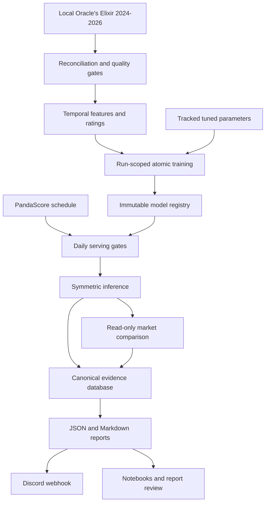

# Oracle Bets Repository Cleanup and Production Hardening - Plan

## Goal Capsule

- **Objective:** Reduce Oracle Bets to one understandable, production-focused LoL research system while improving calibration safety, reproducibility, artifact provenance, and profit evidence.
- **Authority:** Preserve the user-approved midnight LoL workflow and the existing symmetry, leakage, calibration, conservative matching, read-only market, and no-fund-movement boundaries.
- **Execution profile:** Characterize behavior first. Apply small, reversible units. Delete only after caller, test, documentation, and persisted-artifact checks prove the surface is unnecessary.
- **Stop conditions:** Do not promote a model, send a prediction report, delete legacy evidence, or remove a persisted artifact until the applicable verification gate passes.
- **Tail ownership:** The executor owns data migration, a single explicit retune after the final feature schema, routine retraining without Optuna, complete verification, documentation, and removal of abandoned code.

---

## Product Contract

### Summary

Oracle Bets will remain a League of Legends betting research system centered on probability quality rather than feature count or presentation. The repository will have one clear path for historical ingestion, temporal features, ratings, model fitting, calibration, inference, daily reports, Discord webhooks, read-only market comparison, and post-prediction evidence. Counter-Strike and real-sport abstractions are deferred until a second production vertical exists.

The cleanup will remove speculative parallel products, consolidate configuration and documentation, bound operational output, and add deterministic training reports plus thin analysis notebooks. It will also close two production hazards found during the audit: stale daily serving after a critical failure and mixed-generation model artifacts after partial training failure.

### Problem Frame

The branch expanded from 52 to 108 Python package files and from 14,821 to 39,101 Python lines relative to `origin/big-refactor`. The growth includes a second dashboard stack, research services without production callers, duplicate configuration authorities, implicit tuning paths, two evidence stores, unbounded launchd output, and 40 published documentation pages. Generated model parameters are also stored where a scratch rebuild deletes them.

The cleanup must not trade away temporal validation, calibration, symmetry, rollback, or profit evidence merely to reduce file count. Several files must remain separate because they enforce different mutation and safety contracts.

### Requirements

**Identity and configuration**

- R1. Consolidate external team aliases and historical ID-aware identity merges into one validated `team_aliases.json` schema, then remove `team_name_replacements_and_invalid_games.json`.
- R2. Preserve the verified Partizan Esports, Fluxo, and MGN Vikings historical merges while keeping provider aliases such as `AG.AL` semantically separate.
- R3. Make `tier1_plus_erls` the single named operational profile for ingestion, training cohorts, schedule filtering, predictions, and reports; allow explicit research overrides only when the override is recorded.
- R4. Remove configuration theater by either wiring each retained product setting into runtime behavior or deleting it; automatic model promotion must remain disabled.

**Tuning, training, and feature correctness**

- R5. Separate routine retraining from research retuning: routine ingestion and training must never launch Optuna, while explicit retuning must not change production parameters or the serving champion without manual promotion.
- R6. Persist production-tuned rating and supervised-model parameters as tracked, human-readable artifacts with dataset, split, seed, objective, score, feature-schema, code, and search-space provenance.
- R7. Fix rating-parameter correctness, including Glicko initialization, and reject missing or incompatible tuned artifacts with a clear recovery command.
- R8. Generate an auditable source-column reconciliation that classifies every Oracle's Elixir column and blocks prohibited, unavailable, target, constant, or malformed features from the prematch winner model.
- R9. Preserve exact reverse-order probability complementarity and temporal series-grouped tuning, calibration, and untouched test windows.
- R10. Stage every requested training target under one run ID, validate the complete bundle, and publish atomically so a partial failure cannot create mixed-generation serving artifacts.

**State, evidence, and serving safety**

- R11. Move durable generated state under `data/state/`, treat SQLite WAL/SHM files as sidecars, archive and verify the legacy ledger before retirement, and retain one canonical evidence database.
- R12. Keep `models/lol/` as the mutable training workspace and keep a distinct immutable checksum-verified model registry under `data/state/model-registry/lol/`.
- R13. Pin inference to the registry champion; preserve the current champion and rollback target during cleanup and retention.
- R14. Enforce schedule freshness, data freshness, feature-schema compatibility, champion health, and calibrator health before Discord predictions; every daily terminal state must produce a report when the report store is writable.
- R15. Write review reports before webhook delivery; non-dry runs also persist canonical evidence before delivery, while dry runs must not mutate evidence or other non-report state.
- R16. Keep Polymarket comparison read-only and never add betting execution, signing, wallet, private-key, or fund-movement behavior.
- R26. Retain a minimal manual profit-evidence workflow for recording the owner’s bet/no-bet decision, observed and closing odds, capped fractional-Kelly research stake, append-only settlement or correction, calibration, CLV, ROI, drawdown, and stake discipline.
- R27. Treat report persistence as a delivery gate: if the report store is unavailable, suppress Discord delivery and write only a minimal sanitized emergency record to the bounded scheduled-work log.
- R28. Validate local Drive source readiness before reconciliation using stable file size and modification time, required 2024–2026 files, maximum observed match date, current-season progression, and rejection of placeholders or actively changing files.

**Reports, notebooks, logging, and operations**

- R17. Create one deterministic post-training report tree per run with shared manifests, calibration metrics, feature diagnostics, artifact paths, failures, and provenance.
- R18. Strengthen feature interpretation with gain and split importance, probability-scored permutation importance, aggregate SHAP, missingness, drift, temporal stability, and feature-family ablations.
- R19. Add source-controlled notebooks for ingestion quality, calibration/training diagnostics, feature attribution, and profit evidence; notebooks consume generated artifacts and never contain production logic or run in production orchestration.
- R20. Bound logs below 100 MB in steady state, disable progress-bar spam in non-TTY jobs, redact secrets, and remove unbounded launchd stdout/stderr paths.
- R21. Keep `ops/` only for supported deployment configuration: the midnight daily job, periodic research/audit reporting, retention configuration, and a concise runbook.
- R29. Load PandaScore and Discord secrets once at the CLI boundary from a user-owned mode-0600 file outside the repository; never place them in launchd property lists, reports, logs, or committed files.
- R30. Sanitize all provider-derived Discord text, disable allowed mentions, remove control characters, and enforce Discord field and message limits.

**Repository and documentation simplicity**

- R22. Remove duplicate, zero-production-caller, and out-of-scope package surfaces after characterization tests prove the retained production flow.
- R23. Organize surviving code by real responsibility without merging unrelated contracts into existing monoliths or adding second-vertical abstractions.
- R24. Reduce published documentation to canonical pages by subject, absorb unique safety and operating facts, remove stale status claims and superseded pages, and keep historical material out of the main navigation.
- R25. Produce a before/after scoreboard for Python files, Python lines, runtime dependencies, CLI commands, published docs, and proven removed surfaces without using a fixed line target as a safety incentive.
- R31. Govern locked temporal-test access by candidate lineage: feature and deletion decisions use development folds, final acceptance gets one logged locked-test evaluation, and later decisions use forward shadow outcomes.
- R32. Monitor promoted tuned-parameter validity without mutating production state and emit `retune_recommended` from explicit temporal-validation, calibration, target-drift, and dataset-age thresholds.

### Key Flows

- F1. **Routine history refresh and retraining**
  - **Trigger:** An operator refreshes retained 2024–2026 history and trains production targets.
  - **Steps:** Reconcile local source files, validate source and derived data, load compatible tracked tuned parameters, stage all target models, generate one report, register a candidate, and leave champion promotion manual.
  - **Outcome:** No Optuna activity occurs and the serving champion remains intact until explicit promotion; subset-target runs remain research-only and cannot create a promotable candidate.
  - **Covered by:** R3, R5–R10, R17, R28, R31–R32.

- F2. **Explicit research retuning**
  - **Trigger:** An operator runs the dedicated retune command after a schema or research decision.
  - **Steps:** Tune on fixed temporal folds, persist a provenance-complete research candidate, train and evaluate it, then require an explicit parameter and model promotion.
  - **Outcome:** Failure or a weak result leaves production tuned parameters and the champion unchanged.
  - **Covered by:** R5–R10, R13.

- F3. **Midnight daily research**
  - **Trigger:** launchd starts the workflow for a `Europe/Rome` business date.
  - **Steps:** Fetch and filter the schedule, refresh and validate data, optionally stage routine models, validate serving health, predict, compare read-only markets, write report/evidence, then deliver the Discord webhook.
  - **Outcome:** Valid artifacts survive optional-provider failures; critical health failures produce report-only output.
  - **Covered by:** R3, R14–R16, R20–R21.

- F4. **Post-training review**
  - **Trigger:** A training run completes or an owner opens a report or notebook.
  - **Steps:** Read deterministic ingestion, calibration, attribution, drift, cohort, and profit artifacts from the canonical report/evidence contracts.
  - **Outcome:** Review tools do not refit models or create competing calculations.
  - **Covered by:** R11–R13, R17–R19.

- F5. **Manual profit feedback**
  - **Trigger:** The owner reviews a prediction or later observes its closing price and result.
  - **Steps:** Record a bet/no-bet choice, displayed research stake, observed odds, closing odds, and append-only settlement or correction in canonical evidence.
  - **Outcome:** Calibration, CLV, ROI, drawdown, and staking discipline can be evaluated without placing or automating a wager.
  - **Covered by:** R16, R26.

### Acceptance Examples

- AE1. **Routine retrain after a scratch model cleanup**
  - **Given:** Compatible tracked tuned parameters and validated 2024–2026 training data exist.
  - **When:** The operator runs routine training.
  - **Then:** All requested targets train without Optuna, publish as one complete candidate, and leave the current champion unchanged.
  - **Covers:** R5–R7, R10, R13.

- AE2. **Partial target failure**
  - **Given:** A later prop target fails after earlier targets fit successfully.
  - **When:** The staged training run is finalized.
  - **Then:** No part of the staged bundle becomes serving state, the previous champion remains usable, and the failure manifest names the failed target.
  - **Covers:** R10, R13, R17.

- AE3. **Stale schedule or invalid calibrator**
  - **Given:** Stored fixtures exceed the freshness threshold or the champion calibrator fails health validation.
  - **When:** The daily workflow reaches its serving gate.
  - **Then:** JSON and Markdown reports record the failure, but no prediction webhook is sent.
  - **Covers:** R14–R15.

- AE4. **Optional market failure**
  - **Given:** Model predictions are healthy and Polymarket is unavailable.
  - **When:** The daily workflow performs market comparison.
  - **Then:** The prediction report is preserved, the market step is marked unavailable, and no fabricated match is emitted.
  - **Covers:** R15–R16.

- AE5. **Swapped matchup**
  - **Given:** Two resolvable teams and one canonical matchup vector.
  - **When:** Inference is called in both team orders.
  - **Then:** The named-team probabilities reverse exactly and sum to one within machine precision.
  - **Covers:** R8–R9.

- AE6. **Legacy ledger cutover**
  - **Given:** `ledger.db` contains one legacy bet and SQLite sidecars may exist.
  - **When:** The state migration runs.
  - **Then:** SQLite is checkpointed, a hash/integrity-verified archive is created, row counts are reported, canonical state initializes safely, and source deletion requires explicit owner confirmation.
  - **Covers:** R11–R12.

- AE7. **Subset target training**
  - **Given:** The operator trains only props or one named target.
  - **When:** The run completes successfully.
  - **Then:** Reports and workspace artifacts are available for research, but no promotable serving candidate is registered.
  - **Covers:** R5, R10, R13.

- AE8. **Locked-test access**
  - **Given:** Several feature or deletion candidates share one lineage.
  - **When:** Research compares candidates.
  - **Then:** Development folds drive the decisions, only the final candidate receives one logged locked-test evaluation, and subsequent changes wait for forward shadow evidence.
  - **Covers:** R9, R18, R31.

### Success Criteria

- All 12 user-requested cleanup areas map to implemented and verified requirements.
- The final production path has one LoL workflow, one evidence source, one operational league profile, one published documentation authority per subject, and one deterministic report contract.
- Routine retraining records zero Optuna trials; explicit retuning is reproducible and cannot auto-promote.
- A clean 2024–2026 reconciliation, explicit research retune, routine full-target retrain, health validation, and daily dry-run complete successfully.
- Package and dependency counts decrease materially while calibration, symmetry, leakage, rollback, Discord webhook, and read-only market tests remain or improve.

### Scope Boundaries

- Counter-Strike, real sports, generic plugin/module registries, and multi-vertical protocols are deferred.
- Automated betting, approval-to-execution workflows, wallets, signing, private keys, and fund movement are outside the product.
- Current-game draft, champion, side, first-pick, and post-match fields are not prematch winner-model features.
- Feature importance is diagnostic evidence, not causality or proof of profit.
- Notebooks are review tools, not production jobs.

---

## Planning Contract

### Key Technical Decisions

- KTD1. **Keep one production LoL product.** Remove speculative generalized research, future execution, frequent watcher, and second-dashboard surfaces that do not serve the midnight LoL flow. (session-settled: user-directed — chosen over retaining future-vertical scaffolding: the user requested a manageable LoL repository and explicitly deferred other verticals.) Governs R16, R21–R23.
- KTD2. **Use one structured identity file with two rule types.** `team_aliases.json` will contain `external_aliases` and `historical_identity_merges`; their loaders and validation remain separate. Governs R1–R2.
- KTD3. **Treat tuned parameters as source-controlled production inputs.** Defaults define search priors, research retuning produces candidates, and explicit promotion updates compatible production-tuned JSON. Generated model bundles contain copies, not the only surviving parameters. Governs R5–R7.
- KTD4. **Use `tier1_plus_erls` as the operational profile.** Membership permits research and serving consideration, while evidence thresholds separately govern actionability. (session-settled: user-directed — chosen over the smaller duplicated actionable league list: the user named `tier1_plus_erls` as the leagues to work on.) Governs R3–R4.
- KTD5. **Publish full training bundles atomically through the registry.** Every artifact writer receives one run-scoped output root. Only an all-target run can register a promotable candidate; subset runs remain research-only. Inference reads only the champion. Governs R10, R12–R13, R17.
- KTD6. **Keep model workspace and registry distinct.** `models/lol/` remains the mutable workspace; `data/state/model-registry/lol/` remains immutable lifecycle state with retention protection. (session-settled: user-approved — chosen over merging all artifacts into one models tree: the approved audit scope kept the current models structure and required explaining the registry.) Governs R11–R13.
- KTD7. **Keep no dashboard frontend during this cleanup.** Deterministic reports and notebooks are the review experience. Retain the transport-neutral canonical evidence query service for shared calculations, and delete both the legacy Streamlit UI and the React/FastAPI transport. Governs R11, R17–R19, R22–R23.
- KTD8. **Generate reports in shared Python and keep notebooks thin.** Training produces deterministic machine-readable tables and Markdown; notebooks only read these artifacts. (session-settled: user-approved — chosen over executing notebooks in training: production notebook execution would hide required logic and weaken reproducibility.) Governs R17–R19.
- KTD9. **Delete by evidence before moving survivors.** Each removal needs zero required callers or a replacement, and package moves follow deletion in separate units. (session-settled: user-approved — chosen over file-count-driven merging: deletion and organization must preserve safety contracts.) Governs R22–R25.
- KTD10. **Schedule by Rome business date and store UTC event time.** Reports and evidence record both values so a midnight run cannot be assigned to the previous operating day. Governs R14–R15, R20–R21.
- KTD11. **Promote tuned parameters separately from models.** Retuning writes provenance-complete candidates under `reports/lol/tuning/runs/<run-id>/`; an explicit command validates target and feature-schema fingerprints before atomically updating `config/lol/hyperparameters/tuned/`. Model promotion remains a separate manual action. Governs R5–R7, R32.
- KTD12. **Use a one-time ledger migration, not permanent migration code.** Checkpoint, integrity-check, export, count, and hash the one-row legacy database with standard SQLite and SHA-256 tools; retain its manifest and archive, then remove the temporary procedure after owner verification. Governs R11.
- KTD13. **Lock final temporal-test access.** Each candidate lineage records one final-test access; exploratory feature, pruning, and ablation decisions use development windows and later forward shadow outcomes. Governs R9, R18, R31.

### High-Level Technical Design



### Target Repository Shape

```text
config/lol/
  data_ingestion/team_aliases.json
  hyperparameters/default_models_parameters.json
  hyperparameters/tuned/
  training/
config/product/product.json
data/
  README.md
  lol/
  state/
models/lol/
notebooks/lol/
ops/
  README.md
  launchd/
packages/lol-bets/src/lol_bets/
  daily.py
  pipeline.py
  training.py
  data_generation/
  inference/
  prediction_models/
  reporting/
reports/
  README.md
  lol/
docs/
  getting_started/
  lol/
  product/
```

### Implementation Constraints

- Preserve the dirty worktree and distinguish pre-existing changes from cleanup changes before each unit.
- Preserve local Google Drive ingestion, history reconciliation, quarantine, schema fingerprints, and retained 2024–2026 coverage.
- Do not delete model families or feature families solely from importance rank; use identical-fold temporal ablation for behavioral removal.
- Do not move persisted pickle classes without forcing a clean artifact rebuild or providing a compatibility shim.
- Do not move or delete SQLite WAL/SHM files independently.
- Dry-run may write only review reports; it must not mutate source data, processed data, models, registry, evidence, snapshots, or Discord.
- A failed primary report write blocks Discord delivery and falls back only to a minimal sanitized rotating-log record.
- Generated reports, logs, databases, model candidates, notebook outputs, caches, `node_modules`, and site builds remain ignored.
- The retained one-way webhook is the only production Discord surface. Remove the always-on interactive bot; consolidated docs may explain that a future always-on bot would require an owner PC, VPS, or free VM with availability caveats.

### Sequencing

Characterization and safety gates precede deletion. Configuration and feature schemas stabilize before the one required retune. The transport-neutral evidence query service is preserved before both dashboard frontends are deleted. Code pruning precedes import reorganization. After U9, run a production-recovery checkpoint with the explicit retune, tuned-parameter promotion, full-target routine retrain, health check, and daily dry-run before continuing to logs, operations, and documentation. Repeat the no-retune regression proof at final verification.

### Risks and Tradeoffs

- **Artifact compatibility:** Extracting calibrators or preprocessors changes pickle import paths. Mitigation: complete the schema refactor before the required clean retune and test model loading from the registered bundle.
- **Evidence loss:** The legacy ledger contains one bet. Mitigation: checkpoint, integrity-check, hash, export, and require owner confirmation before source removal.
- **Optimistic cleanup:** Removing features can improve simplicity while harming calibration. Mitigation: identical temporal folds, paired Brier/log loss/ECE, and profit-evidence ablations.
- **Stale serving:** Permissive fallbacks can hide failed refreshes. Mitigation: explicit age thresholds and report-only terminal states.
- **Large dirty diff:** Mass movement can obscure regressions. Mitigation: deletion and moves happen in separate units with targeted tests and before/after manifests.
- **Report cost:** SHAP and repeated permutation can make routine training slow. Mitigation: routine summaries use bounded diagnostics; explicit research runs produce the full bundle.
- **Test-set exhaustion:** Repeated cleanup ablations can tune against the nominal final window. Mitigation: KTD13 permits one logged final evaluation per lineage and sends later decisions to forward shadow outcomes.
- **Source staleness:** Google Drive can expose a readable stale or placeholder file. Mitigation: R28 validates source-file stability and data recency before reconciliation or retraining.

---

## Implementation Units

| Unit | Title | Primary files | Depends on |
|---|---|---|---|
| U1 | Freeze behavior and inventory | tests, audit scripts, report schema | — |
| U2 | Consolidate identity and league/product config | `config/`, config loaders | U1 |
| U3 | Make tuning explicit and reproducible | hyperparameter config, ratings, training CLI | U1 |
| U4 | Audit source columns and tighten feature contract | ingestion, feature generation, preprocessing | U2–U3 |
| U5 | Make training and daily serving atomic and gated | training, lifecycle, daily, registry | U3–U4 |
| U6 | Consolidate state and profit evidence | paths, evidence, query service, data state | U1, U5 |
| U7 | Remove speculative and duplicate package surfaces | packages, CLI, dependencies, tests | U1, U6 |
| U8 | Organize and simplify surviving model/workflow code | LoL package, Discord, core | U7 |
| U9 | Produce deterministic reports and notebooks | reporting, observability, notebooks | U4–U5, U8 |
| U10 | Bound logs and reduce operations | logger, CLI, progress, `ops/` | U5, U7 |
| U11 | Consolidate documentation and prove a clean rebuild | docs, MkDocs, full system | U2–U10 |

### U1. Freeze behavior and inventory

- **Goal:** Create a baseline that prevents cleanup from silently changing the production contract.
- **Requirements:** R9, R14–R16, R22, R25.
- **Files:** `tests/lol/`, `tests/core/`, `reports/audits/`, `pyproject.toml`, package entry points.
- **Approach:** Add or strengthen characterization tests for ingestion history, feature symmetry/leakage, multi-target artifacts, daily failure paths, Discord output, conservative market matching, evidence, and registry rollback. Generate a machine-readable inventory for files, lines, dependencies, CLI commands, docs, imports, and persisted paths.
- **Test scenarios:** Reverse-order predictions; market mismatch; absent alias; stale schedule; failed ingestion; failed calibrator; partial target failure; registry fallback; dry-run mutation inventory.
- **Verification:** Targeted characterization suite passes before structural edits; the baseline inventory is stored as generated audit evidence.

### U2. Consolidate identity and league/product config

- **Goal:** Establish one validated authority for team identity and one authority for the operational league profile.
- **Requirements:** R1–R4.
- **Files:** `config/lol/data_ingestion/team_aliases.json`, `config/lol/data_ingestion/team_name_replacements_and_invalid_games.json`, `config/lol/data_ingestion/considered_leagues.json`, `config/product/product.json`, `packages/oracle-bets-core/src/oracle_bets_core/paths.py`, `packages/oracle-bets-core/src/oracle_bets_core/config.py`, `packages/oracle-bets-core/src/oracle_bets_core/league_selection.py`, `packages/lol-bets/src/lol_bets/data_generation/ingestion/oracles_elixir.py`, `packages/lol-bets/src/lol_bets/pipeline.py`.
- **Approach:** Add schema validation for separate external and historical rules, validate canonical targets and non-overlapping historical IDs, migrate the three verified merges, and delete the empty invalid-game mechanism. Replace the duplicated product league list with `profile: tier1_plus_erls`. Wire retained product values or delete unused keys; keep promotion manual.
- **Test scenarios:** Historical name and ID rewrite; provider alias resolution; cycles; unknown targets; overlapping periods; taxonomy completeness; unknown PandaScore league; research override provenance; evidence threshold independent of profile membership.
- **Verification:** Config tests pass and a 2024–2026 reconciliation retains successor identities with no duplicate historical franchises.

### U3. Make tuning explicit and reproducible

- **Goal:** Guarantee that routine data generation and training reuse frozen compatible parameters.
- **Requirements:** R5–R7.
- **Files:** `config/lol/hyperparameters/`, rating modules under `packages/lol-bets/src/lol_bets/data_generation/feature_engineering/ratings_features/`, `packages/lol-bets/src/lol_bets/prediction_models/gbdt_model.py`, `packages/lol-bets/src/lol_bets/training.py`, `packages/oracle-bets-core/src/oracle_bets_core/cli.py`.
- **Approach:** Create validated tracked tuned JSON for ratings and each production LightGBM target. Seed Optuna, remove hard-coded trial-count drift, persist full provenance, fix Glicko initialization, and make missing/incompatible artifacts fail. Remove `train --force-retune`; implement KTD11 with research candidates, compatibility validation, and atomic parameter promotion. Add the non-mutating R32 validity monitor.
- **Test scenarios:** Missing tuned file; incompatible feature fingerprint; deterministic seeded search; routine ingest/train with an Optuna spy; retune failure; research candidate without promotion; atomic tuned-parameter promotion; Glicko new-entity initialization; `retune_recommended` at and below each threshold.
- **Verification:** Routine commands record zero studies/trials; repeated seeded research tuning produces reproducible folds and metadata; production files change only through explicit promotion; drift monitoring cannot mutate them.

### U4. Audit source columns and tighten the feature contract

- **Goal:** Make column inclusion, exclusion, and temporal availability reviewable.
- **Requirements:** R8–R9, R18.
- **Files:** ingestion column config, training configs, `packages/lol-bets/src/lol_bets/data_generation/ingestion/quality.py`, feature generation, `packages/lol-bets/src/lol_bets/prediction_models/data_preprocessor.py`, feature contract tests.
- **Approach:** Persist `datacompleteness` and `split` as metadata. Report `source_status` as one of present, missing, or new and `disposition` as one of required, metadata, feature, ignored, prohibited, or candidate. Fail only on required-schema violations. Add R28 source readiness. Remove constant BO flags, duplicate series-game fields, cancelled patch pivots, zero matchup deltas, and `nan` dummy categories before model fitting. Keep draft and post-map fields prohibited. Evaluate candidates only under KTD13.
- **Test scenarios:** New source column alert; missing required column; stale, placeholder, and changing Drive files; absent retained season; sparse candidate; current-game champion prohibition; side/first-pick prohibition; constant-feature rejection; delta negation; invariant context; source-schema report determinism; locked-test access refusal.
- **Verification:** Every source column has one applicable status and one disposition, every configured training column exists, Drive readiness passes, and the winner feature matrix contains no targets, prohibited fields, constants, invalid categories, or asymmetric transforms.

### U5. Make training and daily serving atomic and gated

- **Goal:** Prevent mixed model generations and stale or unhealthy prediction delivery.
- **Requirements:** R10, R13–R15, R17.
- **Files:** `packages/lol-bets/src/lol_bets/training.py`, `packages/lol-bets/src/lol_bets/operations/models.py`, `packages/lol-bets/src/lol_bets/daily.py`, registry and health modules, Discord delivery path.
- **Approach:** Give each training invocation one run ID and a run-scoped output-path contract used by every model, calibrator, feature pipeline, parameter copy, metric, figure, and manifest writer. Validate all requested targets before updating the mutable workspace or registering directly from staging. Only all-target runs can register. Pin inference to the champion. Replace permissive skipped-step success with explicit critical and optional outcomes. Define schedule/data age thresholds, enforce R27, sanitize provider text under R30, write reports before delivery, and represent Rome business date plus UTC event time.
- **Test scenarios:** Later-target failure with no shared-path writes; subset-target run; invalid calibrator; stale schedule; failed refresh; stale healthy champion within and beyond policy; market outage; webhook outage; unwritable report store; malicious provider mention/control/oversize text; dry-run mutation check; UTC/Rome boundary.
- **Verification:** Failure injection never changes the mutable workspace or serving generation; every writable-store daily terminal path writes a report; report failure blocks delivery and logs minimally; only a fully healthy run sends sanitized prediction content.

### U6. Consolidate state and profit evidence

- **Goal:** Make durable state obvious and retain one manual prediction-to-profit evidence path.
- **Requirements:** R11–R13, R16, R26.
- **Files:** `packages/oracle-bets-core/src/oracle_bets_core/paths.py`, evidence and backup modules, `packages/oracle-bets-dashboard/`, `data/README.md`, `.gitignore`.
- **Approach:** Add `data/state/`, move registry state with champion checksum verification, execute KTD12, and initialize the canonical evidence database. Preserve the transport-neutral evidence query service. Add the R26 append-only manual workflow and immutable correction linkage. Remove direct legacy writes after owner-verified archival; never silently reinterpret the one legacy row.
- **Test scenarios:** WAL-mode read/write; one-time archive byte/hash and integrity verification; row-count report; owner-confirmed cutover; registry relocation; champion/rollback retention; manual bet/no-bet record; closing odds; settlement correction; evidence queries; path overrides.
- **Verification:** Canonical evidence and registry health pass from the new root; the verified legacy archive exists before old callers or source state are eligible for deletion; calibration, CLV, ROI, drawdown, and staking-discipline views derive from canonical append-only evidence.

### U7. Remove speculative and duplicate package surfaces

- **Goal:** Delete code and dependencies that do not serve the retained LoL product.
- **Requirements:** R21–R23, R25.
- **Files:** package modules, `packages/oracle-bets-dashboard/web/`, dashboard API/launcher, `pyproject.toml`, `uv.lock`, CLI registrations, associated tests and docs.
- **Approach:** After U1 characterization, preserve only the transport-neutral evidence query service and remove both dashboard frontends, FastAPI transport, launcher, and legacy writable pages. Remove after-Map-1, generic proposal, future execution, approval, live-paper, frequent watcher, and always-on interactive bot products; unused Discord registries/protocols; disabled WHR; unused BestOfs and handicap surfaces; TabNet; Boruta/RFECV modes; Polars fallback; and wrappers that only delegate. Keep prematch prop models and one-way Discord prop reporting. Shrink the benchmark path to shared temporal evaluation instead of a second trainer.
- **Test scenarios:** Import/caller scan; CLI help snapshot; dependency import smoke test; retained daily prop output; retained series math; retained registry rollback; retained evidence writes.
- **Verification:** Removed symbols have zero runtime, test, documentation, entry-point, or persisted-artifact callers; `uv sync` and retained package imports succeed without deleted dependencies.

### U8. Organize and simplify surviving model/workflow code

- **Goal:** Make the retained package navigable without replacing deletion with cosmetic indirection.
- **Requirements:** R9, R17–R18, R23.
- **Files:** `packages/lol-bets/src/lol_bets/`, `packages/oracle-bets-core/src/oracle_bets_core/`, `packages/oracle-bets-discord/src/oracle_bets_discord/`.
- **Approach:** Keep `pipeline.py`, `training.py`, and `daily.py` as entry flows. Move roster and series logic under inference, reporting logic under `reporting/`, and retained evaluation logic under prediction models. Split calibrators, persisted feature transformation, and evaluation from the large GBDT module only where ownership and the mandatory clean artifact rebuild justify it. Reduce Discord to one sanitized one-way LoL webhook path.
- **Test scenarios:** Old import migration; pickle artifact rebuild; calibration round-trip; feature-pipeline round-trip; daily and Discord integration; direct CLI entry points.
- **Verification:** No compatibility shim remains after the clean rebuild unless a retained artifact requires it; module-level tests and package import scans pass.

### U9. Produce deterministic reports and notebooks

- **Goal:** Make ingestion, calibration, attribution, and profit evidence easy to review without terminal archaeology.
- **Requirements:** R17–R19.
- **Files:** new `packages/lol-bets/src/lol_bets/reporting/`, observability/evaluation modules, `notebooks/lol/`, `reports/README.md`, report-schema tests.
- **Approach:** Consolidate per-model figure and insight trees under `reports/lol/training/runs/<run-id>/<target>/` with one top-level manifest and atomic latest pointer. Retain the last eight or 90 days of unpromoted full reports, protect promoted or prediction-referenced reports indefinitely, and make pruning dry-run-first. Add split and gain importance, negative-log-loss permutation tables for winner models, suitable regression scores for props, aggregate SHAP, feature-family summaries, fold stability, calibration, cohorts, missingness, drift, and ablations. Add four cleared-output notebooks that read these contracts and show helpful missing-artifact messages.
- **Test scenarios:** Shared run ID; deterministic normalized manifest; partial-failure report; atomic latest update; repeated-run pruning; protected promoted/referenced report; gain/split tables; permutation scoring; SHAP aggregation; feature-family and fold stability; notebook execution on synthetic artifacts; cleared committed outputs.
- **Verification:** Routine training creates bounded summary artifacts; an explicit research report creates the full evidence bundle; retention stays bounded without deleting protected evidence; notebooks contain no imports from private training internals and execute as consumers.

### U10. Bound logs and reduce operations

- **Goal:** Support midnight and periodic research jobs without unbounded disk growth.
- **Requirements:** R20–R21.
- **Files:** `packages/oracle-bets-core/src/oracle_bets_core/logger.py`, CLI boundaries, rating/feature progress calls, `ops/`.
- **Approach:** Configure logging once per CLI process, use module loggers and one 10 MiB rotating scheduled-work file with five backups, suppress `tqdm` outside a TTY, and redact provider credentials and payloads. Load secrets under R29. Keep daily and periodic research/audit launchd examples, remove watcher/hourly examples, route launchd stdout/stderr to `/dev/null` after application logging is proven complete, document install/uninstall and credential rotation/revocation, and validate property lists.
- **Test scenarios:** Handler deduplication; exact rotation size/count; no additional scheduled file handlers; secret-file permission and repository-location rejection; secret redaction; non-TTY progress; structured run fields; launchd stdout/stderr redirection; plist validation.
- **Verification:** Maximum steady-state log allocation is below 100 MB and `plutil -lint` passes every retained plist example.

### U11. Consolidate documentation and prove a clean rebuild

- **Goal:** Publish one accurate documentation set and validate the complete cleaned system.
- **Requirements:** R1–R25.
- **Files:** `README.md`, `docs/`, `mkdocs.yml`, final audit report.
- **Approach:** Build a source-to-destination map before deletion. Consolidate installation/quickstart, operations/hosting, LoL data pipeline, modeling, validation, market research, data/identity, interfaces, security, and roadmap. Absorb unique facts and delete superseded audits and status/model-card pages; Git history is the archive. Document retraining versus retuning, tracked tuned artifacts, state paths, manual profit evidence, reports/notebooks, retention, one-way webhook hosting, secret rotation, missed-run recovery, and the caveats for reintroducing an always-on bot on a PC, VPS, or free VM. Confirm the earlier production-recovery checkpoint, then repeat the routine no-retune and daily regression gates.
- **Test scenarios:** Documentation link and command checks; no stale paths; no contradictory dry-run or Kelly claims; superseded pages absent; fresh reconcile/retune/retrain checkpoint; final no-retune regression; final inventory comparison.
- **Verification:** Strict MkDocs, full test/lint gates, health/data checks, clean model loading, and the final daily dry-run pass; the final scoreboard names every intentional deletion and retained safety surface.

---

## Verification Contract

| Gate | Command or check | Proves |
|---|---|---|
| Repository baseline | `git status --short --branch` plus generated call/dependency/path inventory | Dirty-worktree preservation and deletion evidence |
| LoL tests | `uv run pytest tests/lol` | Ingestion, features, symmetry, training, calibration, inference, daily, Discord |
| Core tests | `uv run pytest tests/core` | Evidence, registry, state, settlement, operations |
| Lint | `uv run ruff check packages tests` | Import and code hygiene after deletion/moves |
| Documentation | `uv run mkdocs build --strict` | Navigation, links, and canonical docs |
| Data health | `uv run oracle-bets lol validate-data` | Training table and schema health |
| Artifact health | `uv run oracle-bets lol health` | Model, calibrator, feature schema, and champion health |
| History | `uv run oracle-bets lol reconcile-history` | Fresh local 2024–2026 reconciliation and source manifest |
| Research retune | `uv run oracle-bets lol retune --model-type lightgbm --feature-set selected` | Explicit seeded Optuna path and research-only output |
| Routine retrain | `uv run oracle-bets lol train --model-type lightgbm --feature-set selected` with Optuna instrumentation | Compatible full-target training with zero retuning |
| Daily | `uv run oracle-bets daily lol --dry-run --skip-market-search` | Filtered schedule, serving gates, JSON/Markdown report, no non-report mutations |
| Operations | `find ops -name '*.plist.example' -print0 \| xargs -0 -n1 plutil -lint` | Valid retained launchd configuration |
| Notebooks | Execute cleared notebooks against a small synthetic report fixture | Notebook contracts and missing-artifact behavior |
| State migration | SQLite integrity/hash/row-count and registry checksum tests | No evidence or champion loss |
| Safety review | Secret scan plus search for wallet/signing/private-key/fund-movement code | Read-only product boundary |

The explicit retune gate runs once because the feature and artifact schema changes. All later scheduled and routine training gates use stored compatible parameters without Optuna.

---

## Definition of Done

- Every requirement R1–R25 has a passing test, artifact check, documentation destination, or removal proof.
- The three verified historical identity merges and all supported external aliases work through one configuration file.
- `tier1_plus_erls` is the only default operational profile and actionability remains evidence-gated.
- Default hyperparameters are documented search priors; production-tuned parameters are tracked, reproducible, compatible, and separate from generated model bundles.
- The winner model contains no unavailable, prohibited, constant, or asymmetric features and remains exactly complementary under team reversal.
- Multi-target training publishes atomically; daily delivery cannot use stale or unhealthy serving state.
- One canonical evidence database and one immutable registry survive migration with verified legacy archival and protected champion/rollback state.
- The repository contains no dashboard frontend, one one-way Discord LoL path, one market-comparison path, and no automated execution surface.
- Training reports and notebooks expose calibration and feature evidence without duplicating model logic.
- Logs and generated reports have tested retention limits; ops contains only supported scheduling configuration.
- Published documentation has one owner per subject and all copied unique facts are removed from superseded pages.
- Full verification passes, including one explicit retune, one routine no-retune retrain, health/data validation, strict docs, and daily dry-run.
- The final inventory shows a material reduction in code, dependencies, commands, and published pages while retaining the production safety contracts.
- No dead code, temporary compatibility layer, abandoned experiment, generated notebook output, cache, or dead-end implementation remains from the cleanup.
