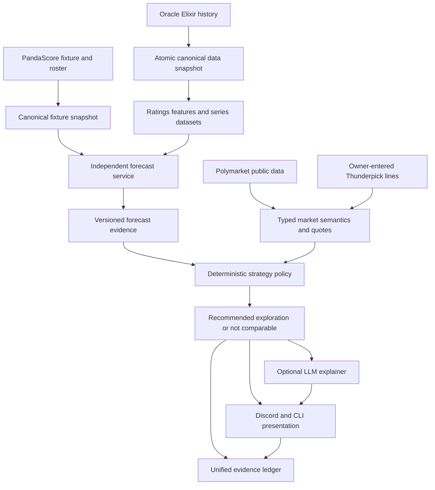
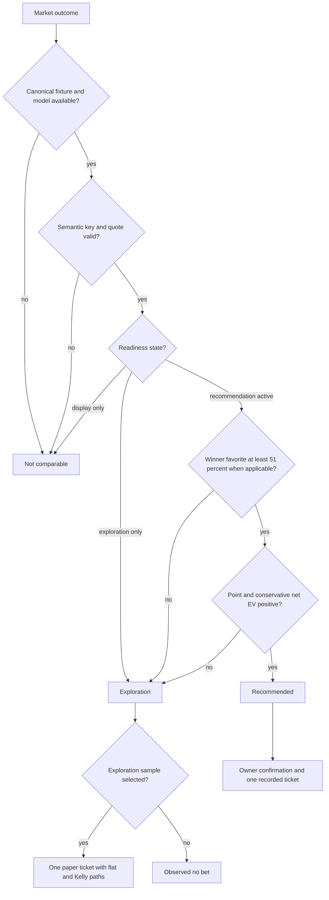
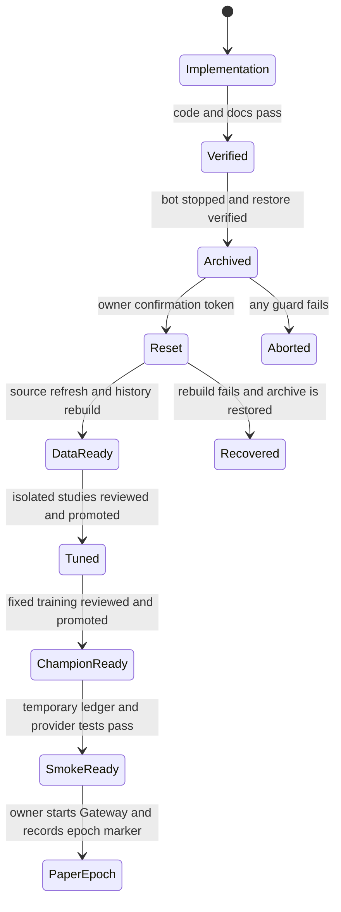

# Oracle Bets LoL Paper-Testing V4 - Plan

## Goal Capsule

- **Objective:** The owner can refresh LoL history, produce independent calibrated forecasts, compare exact bookmaker markets, record and settle paper bets, and judge profitability from cohort-aware evidence without market leakage or automated wagering.
- **Means:** Establish strict data and model contracts, add a deterministic strategy policy, complete the unified ledger and Discord owner console, remove superseded code, then perform one guarded clean reset and research rebuild. (KTD1-KTD15)
- **Authority:** Product requirements and structural safety gates override convenience, model recency, positive point EV, LLM prose, and owner-facing presentation.
- **Execution profile:** Implement and verify code first. Perform the destructive reset and research jobs only after the repository is clean and the backup restore check passes.
- **Stop conditions:** Stop before paper evidence begins if the current source is stale, model provenance is dirty, any train/serve or symmetry check fails, provider semantics are ambiguous, or the reset archive cannot be restored.
- **Tail ownership:** Deterministic services own calculations and evidence. The owner selects fixtures, supplies Thunderpick lines, confirms recorded bets, and settles results. The optional LLM only explains stored decisions.

---

## Product Contract

### Summary

Oracle Bets will become a Discord-first LoL paper-research system with one independent prediction boundary and one append-only evidence ledger. Each comparable market receives a deterministic `recommended`, `exploration`, or `not_comparable` decision. Every recorded bet identifies whether it came from the recommended or exploration lane. The system records flat 1u, full-Kelly, half-Kelly, and quarter-Kelly counterfactuals without creating duplicate tickets. A fresh paper epoch begins only after code verification, a guarded state reset, new Optuna research, fixed-parameter training, model review, and promotion.

### Problem Frame

The repository is operationally mature but not yet safe to treat as a profit system. The current champion has a useful direct-series model, exact winner symmetry, temporal splits, and an immutable registry. Its sealed series log loss is `0.5541`, but its calibration intercept is `-0.1425`, outside the intended absolute `0.10` recommendation boundary. The map calibrator slightly worsens sealed log loss (`0.6123` calibrated versus `0.6119` raw). The prop models have weak explanatory power and no historical bookmaker-line backtest: duration `R²=0.0635`, kills `R²=0.0662`, and towers `R²=0.0014`.

The active workflow also lacks the evidence contract needed to distinguish recommendations from research samples. Kelly alternatives are not persisted. Unified-ledger performance cannot compute the documented fixture-clustered profitability gate. Model inference may construct fixture facts from a Polymarket event when the schedule does not match. The current source cache is stale as of August 22, 2026, and the working tree contains a large uncommitted V3 migration. These are paper-start blockers, not presentation issues.

### Key Decisions

- **Independent probabilities remain permanently market-free.** (session-settled: user-directed — chosen over blending Polymarket or bookmaker prices into the model: the goal is to measure and beat the market without circular predictions.) Governs R1, R8, R21.
- **Every recorded bet carries a recommended or exploration type.** (session-settled: user-directed — chosen over one undifferentiated paper lane: forced research coverage must not masquerade as a profitable recommendation.) Governs R9-R12, R18.
- **Map 2+ research is available only for prematch-close series.** (session-settled: user-directed — chosen over a universal comeback rule: non-close series should retain the favorite or defer to owner draft judgment.) Governs R14-R16.
- **One unit equals one percent of bankroll and four sizing paths are tracked.** (session-settled: user-directed — chosen over one flat or one fractional-Kelly record: the owner wants full, half, and quarter Kelly compared with a 1u baseline.) Governs R17-R19.
- **The LLM explains deterministic decisions only.** (session-settled: user-directed — chosen over agent-created bets or numbers: probabilities, decisions, sizing, promotion, and settlement must remain reproducible.) Governs R22-R23.
- **Strategy activation is cohort-level.** (session-settled: user-directed — chosen over all-data aggregate approval: weak leagues, targets, periods, and probability bands must not hide behind a good global score.) Governs R6-R7, R11, R20.
- **A new paper epoch starts from regenerated state.** (session-settled: user-directed — chosen over continuing legacy artifacts and evidence: the owner wants new tuning, training, reports, logs, and paper results to share one clean start.) Governs R29-R31.

### Requirements

**Independent data and model contract**

- R1. Forecast inputs must originate from approved non-market sources and must reject all prices, odds, market titles, market-derived fixture facts, drafts, sides, and post-start results unless a separate timestamped live model owns them.
- R2. Source refresh and history publication must atomically publish a mutually consistent data set and manifest after schema, identity, duplicate, season, and freshness checks pass.
- R3. Canonical team and fixture identities must be produced by one resolver shared by ingestion, schedule, forecasting, market review, bets, and performance.
- R4. Winner inference must rebuild current matchup deltas, enforce feature lineage and availability times, and return exact complementary probabilities after team reversal.
- R5. Retuning must search only development folds; calibration, selection, uncertainty, and final test windows must remain chronological, series-clustered, timestamp-atomic, and isolated.
- R6. Each target and preregistered actionable cohort must publish a versioned readiness state of `recommendation_active`, `exploration_only`, or `display_only`. `display_only` forecasts cannot enter the exploration sampler or create a ticket.
- R7. Model promotion health and strategy readiness must remain separate so a structurally healthy recent champion cannot silently activate a weak betting strategy.

**Market comparison and deterministic decisions**

- R8. Market prices may enter only the post-forecast semantic join, executable quote, expected-value, sizing, and CLV layers.
- R9. Every market evaluation must be classified as `recommended`, `exploration`, or `not_comparable` with a policy version and complete reason codes.
- R10. A direct-series outcome is recommendation-eligible only when the independent favorite is at least `51%`, the target and league cohort are active, and both point and the versioned validated conservative net EV are positive at the captured odds.
- R11. Map winners, next-map winners, derived totals or handicaps, duration, kills, and towers remain exploration until their own sealed cohort and paper-evidence gates activate them.
- R12. For each submitted fixture and offered target or period whose readiness is at least `exploration_only`, the exploration sampler selects at most one highest-point-EV comparable outcome when no recommendation exists. This creates separate research samples for series winner, Map 1 winner, and each offered length/kills/towers market on every scheduled map; an unplayed later-map ticket settles `void`. `display_only`, invalid semantics, or missing probabilities remain `not_comparable` and produce no substitute or ticket.
- R13. Provider comparison identity must include fixture, target, period or map number, selection, line, BO format, stat definition, push or void rules, and a resolution-rule fingerprint. Reviews are prestart only within the versioned 1-hour-to-14-day horizon; started, closed, corrected, or cancelled markets are `not_comparable`.
- R14. The provisional close-series definition is an independent direct-series favorite of at most `60%`; `60.00%` qualifies and `60.01%` does not.
- R15. A Map 2+ probability must come from the separately validated score-aware next-map model after the owner records the completed-map result with a source reference.
- R16. The system must never recommend the Map 1 loser as a heuristic. Non-close series cannot invoke the score-aware next-map model; the owner may separately record either the frozen prematch favorite or draft judgment as an `owner_discretion` exploration bet with no model-calibration credit.

**Sizing and evidence**

- R17. The ledger must freeze `unit_bankroll_fraction=0.01`, flat 1u, full Kelly, half Kelly, quarter Kelly, accepted odds, and the probability used for sizing at bet-open time.
- R18. One owner action creates one ticket and one settlement while performance derives all four counterfactual sizing paths from the same outcome.
- R19. A non-positive-EV exploration sample records a flat 1u research path and zero Kelly fractions. Positive-EV paper samples use full Kelly as the primary recorded path while flat 1u, half Kelly, and quarter Kelly remain counterfactual comparisons; none authorizes real-money exposure.
- R20. Performance must separate paper from real, currency from currency, recommended from exploration, direct from derived, and ticket-level from fixture-clustered results.
- R21. The ledger must preserve every reviewed opportunity, no-bet reason, owner selection, accepted price, settlement statistic, source, correction, and model or policy version. Profit activation evidence must come from a preregistered consecutive-capture schedule cohort, not the owner-selected accepted-bet subset.

**Discord, LLM, and operations**

- R22. Discord and CLI must call the same owner-authorized application services and produce the same deterministic decision and evidence IDs for the same inputs.
- R23. The optional LLM receives one immutable versioned allowlist context containing approved reason codes and minimum authoritative model/market values only. It may return explanation text with approved reason references; it cannot receive raw provider payloads, owner rationale, identity, bankroll, currency, credentials, local paths, or ledger history, and cannot create or change numbers, selections, classifications, stakes, writes, model lifecycle, or settlement.
- R24. Thunderpick remains link-plus-owner-entered lines with no HTTP request, scraping, login, or automation.
- R25. Discord must support schedule, exact-link review, controlled and bulk Thunderpick line entry, decision browsing, bet recording, open and closed bets, manual result entry, settlement confirmation, performance, health, and recent-run recovery. Every sensitive owner-console response or attachment must be ephemeral or confined to an allowlisted private channel.
- R26. Daily maintenance must refresh and validate source history, identities, features, ratings, series, schedule, health, and fixed-parameter retraining triggers without automatic market discovery or settlement.
- R27. Training, retuning, tuning promotion, champion promotion, rollback, and destructive reset remain owner-controlled CLI operations.
- R28. No code path may place a bookmaker or Polymarket order, sign data, access wallets or private keys, or move funds.

**Clean rebuild and maintainability**

- R29. The reset must hold an exclusive maintenance lock against every state writer, create and restore-verify an external checksummed owner-only archive, emit a canonical deletion manifest, and require a short-lived single-use confirmation bound to the manifest, archive, repository, commit, and epoch before deleting generated LoL state.
- R30. The reset may delete generated caches, derived data, models, registry state, evidence, reports, logs, documentation build output, and test caches; it must preserve source code, tracked configuration, reviewed source aliases, notebooks, `.env`, `.venv`, and the external Drive source.
- R31. The new epoch must refresh 2024-2026 history, rebuild series, run isolated target research, review and promote tuned parameters, run a full fixed-parameter bundle, review and promote a champion, initialize evidence, smoke-test Discord and providers, then record an epoch marker before paper evidence begins. Every exposed final holdout retires after its one acceptance decision; a modified candidate requires a strictly later non-overlapping holdout.
- R32. The maintained documentation set must remain README plus `docs/index.md`, `docs/system.md`, `docs/commands.md`, and `docs/roadmap.md`, with this plan retained as the implementation record.
- R33. Production-code deletion and consolidation must be behavior-proven by characterization and invariant tests; reducing line count must never weaken leakage, temporal, symmetry, evidence, or provider boundaries.

### Success Criteria

- The fresh direct-series target is recommendation-ready only if it passes the rating baseline, calibration, symmetry, leakage, actionable-cohort, and provenance gates.
- Every supported review contains one deterministic classification per comparable outcome, complete reason codes, four sizing paths, model and data timestamps, and one JSON/Markdown report pair.
- The owner can complete schedule to review to paper bet to manual result and settlement in Discord without remembering CLI syntax.
- Performance reports can reproduce recommendation coverage, calibration, CLV completeness, drawdown, and lower-95% fixture-clustered ROI by the required cohorts.
- Activation reports distinguish consecutive shadow strategy opportunities from owner-accepted tickets and disclose schedule/provider coverage.
- Generated state is absent from a fresh clone and bounded logs cannot grow without limit.
- The new paper epoch begins with a clean Git commit, fresh data, fresh reviewed tuning, one healthy champion, an empty ledger, and a documented rollback archive.

### Key Flows

- F1. **Daily readiness**
  - **Trigger:** The scheduled job or owner starts daily maintenance.
  - **Steps:** Refresh source, publish history atomically, rebuild derived facts, validate health, evaluate fixed retraining triggers, fetch the filtered schedule, and report status.
  - **Outcome:** The owner sees fresh actionable fixtures or an exact fail-closed reason.
  - **Covered by:** R1-R7, R26-R27.
- F2. **Prematch review and record**
  - **Trigger:** The owner submits one Polymarket link and optionally one Thunderpick link for one fixture.
  - **Steps:** Resolve the canonical non-market fixture, forecast once, join exact provider semantics, classify every comparable outcome, show Kelly tracks, optionally explain, and confirm one paper record.
  - **Outcome:** The ledger contains one immutable owner action linked to the full decision evidence.
  - **Covered by:** R8-R13, R17-R25.
- F3. **Map 2+ exploration**
  - **Trigger:** A close prematch series completes a map and the owner records the result.
  - **Steps:** Validate the source and series state, run the score-aware model, compare a new owner-supplied market, classify as exploration, and optionally record one ticket.
  - **Outcome:** Reactive evidence remains separate from prematch and draft-discretion evidence.
  - **Covered by:** R14-R16, R20-R25.
- F4. **Manual grading and learning**
  - **Trigger:** The owner supplies verified fixture and map statistics.
  - **Steps:** Preview derived bet outcomes, confirm Win/Loss/Push/Void events, update four sizing paths, and render cohort performance.
  - **Outcome:** Results are append-only, reproducible, correction-aware, and never LLM-settled.
  - **Covered by:** R17-R23, R28.
- F5. **Fresh epoch bootstrap**
  - **Trigger:** All implementation and non-destructive verification are green.
  - **Steps:** Quiesce, archive, restore-verify, reset generated state, rebuild, retune, promote tuning, train, promote the champion, smoke-test, and mark the epoch.
  - **Outcome:** New paper evidence cannot mix with legacy models or ledgers.
  - **Covered by:** R29-R33.

### Acceptance Examples

- AE1. **Direct series recommendation:** Given a fresh active series target at `58%`, compatible odds of `1.90`, positive conservative net EV, and healthy fixture evidence, the result is `recommended` and one recorded bet stores four sizing paths.
- AE2. **Forced research coverage:** Given a valid `exploration_only` target whose best offered side has negative point EV, the result is `exploration`, full/half/quarter Kelly are zero, and the flat 1u research path is preserved. The same input under `display_only` is `not_comparable` and cannot create a ticket.
- AE3. **Weak positive-EV prop:** Given a positive-EV towers half-line while towers readiness is weak, the result remains `exploration`.
- AE4. **Unsafe market:** Given a missing calibrator, integer kills/towers line without push mass, ambiguous token orientation, incompatible rules, or invalid quote, the result is `not_comparable` and no bet is fabricated.
- AE5. **Close-series boundary:** Given a direct-series favorite at `60.00%`, score-aware Map 2 research is available; at `60.01%`, it is unavailable.
- AE6. **No comeback heuristic:** Given a close series where the Map 1 loser remains the next-map underdog, the system does not flip the recommendation to the loser.
- AE7. **Symmetry:** Reversing the two teams exactly complements series, map, next-map, and handicap winner probabilities while totals and scalar prop distributions remain invariant.
- AE8. **One ticket, four paths:** Settling one bet updates one ticket count and the flat/full/half/quarter PnL tracks without creating four positions.
- AE9. **Provider isolation:** A Thunderpick URL causes no HTTP request, and a Polymarket failure does not discard the independent forecast or owner-entered Thunderpick line.
- AE10. **LLM containment:** A missing, timed-out, schema-invalid, numeric-inventing, or prompt-injected response leaves the deterministic decision and ledger unchanged.
- AE11. **Cohort protection:** An all-league improvement cannot activate a target for a sufficiently large actionable league cohort that materially regresses.
- AE12. **Reset safety:** A reset attempt with a running bot, failed archive integrity, missing confirmation, or an external Drive path inside the deletion set fails without deleting state.
- AE13. **Non-close live discretion:** Given a non-close series after Map 1, the score-aware model is unavailable. An owner-entered draft or frozen-favorite bet is stored as `owner_discretion` exploration and excluded from model calibration.
- AE14. **Intention-to-treat evidence:** Rejecting an otherwise recommended direct-series ticket does not remove its shadow result from the preregistered activation cohort, and owner-accepted ROI remains a separate metric.

### Scope Boundaries

#### Deferred to Follow-Up Work

- A timestamped draft-aware model with champions, bans, sides, patch, roster identities, and separate `draft_assisted` evidence.
- Authorized provider APIs for automatic Thunderpick metadata or lines if Thunderpick later offers and permits one.
- Portfolio Kelly or covariance-aware real-money sizing after correlated paper evidence exists.
- Provider-backed settlement after identity, corrections, and owner opt-in are proven.
- Counter-Strike and real-sport adapters after LoL evidence gates pass.

#### Outside This Product's Identity

- Automated wagering, orders, signing, wallets, private keys, deposits, withdrawals, or fund movement.
- Scraping Thunderpick or bypassing provider access controls.
- Market probabilities as model features, labels, calibrators, priors, or blend components.
- LLM-created bets, probabilities, prices, gates, sizes, promotions, or settlements.

---

## Planning Contract

### Key Technical Decisions

- KTD1. **Enforce a one-way dependency boundary.** Canonical non-market fixture and history produce forecasts; provider semantics and quotes join afterward; deterministic policy evaluates; optional prose renders last. Governs R1, R8, R21-R23.
- KTD2. **Persist a small versioned strategy-scope artifact.** It maps target and cohort readiness to `recommendation_active`, `exploration_only`, or `display_only` and extends the existing candidate review rather than adding a second model registry. `display_only` never maps to a recordable decision. Governs R6-R7, R11-R12.
- KTD3. **Use three decision states and two bet lanes.** Reviews store `recommended`, `exploration`, or `not_comparable`; only the first two may become a bet, and the bet copies that lane immutably. (session-settled: user-directed — chosen over a single positive-EV classification: research samples must stay separate from recommendation evidence.) Governs R9-R12, R20.
- KTD4. **Use uncertainty-relative recommendation gates.** The independent favorite must be at least `51%`; point and conservative EV must both be positive after recorded provider costs, but the conservative probability does not itself need to exceed `50%`. Governs R10.
- KTD5. **Treat direct series as the only initial recommendation candidate.** Map 1, next map, path-derived markets, and all props begin as exploration because their current sealed or market-line evidence is insufficient. Governs R6-R7, R11, R14-R16.
- KTD6. **Preregister close series as `abs(p_series - 0.5) <= 0.10`.** Historical cohort membership uses persisted rolling out-of-fold direct-series probabilities produced only from earlier data; serving uses the frozen live prematch forecast. Apply the same versioned boundary to training cohorts, inference availability, Discord, evidence, and performance. (session-settled: user-approved — chosen over all-series Map 2+ deployment: reactive research is intended only for matchups predicted to be close.) Governs R14-R16.
- KTD7. **Calculate four sizing paths from one frozen probability and price.** Store flat 1u plus full, half, and quarter Kelly from one accepted quote; full Kelly is the primary positive-EV paper path requested by the owner, the other paths are counterfactuals, and negative-EV exploration uses flat 1u because every Kelly fraction is zero. One confirmation creates one ticket, never one ticket per sizing path. Governs R17-R20.
- KTD8. **Make semantic equivalence a versioned key.** Provider adapters and manual input share a controlled vocabulary and resolution fingerprint; integer count props remain `not_comparable` until a discrete push model exists. Governs R13, R24.
- KTD9. **Use one active unified evidence fact model.** Reuse current `runs`, `run_events`, `predictions`, `forecasts`, `market_candidates`, `market_snapshots`, `bets`, `bet_events`, and `corrections`; add a physical table only when those primitives cannot enforce a named invariant. Legacy evidence is exported before the new epoch instead of remaining active compatibility code. Governs R18-R21, R29-R31.
- KTD10. **Use deterministic Discord application services with durable run IDs.** CLI and Discord are adapters; long work persists status and can be reopened through Recent Runs after restart. Governs R22, R25-R27.
- KTD11. **Constrain the LLM to an optional post-bootstrap explanation adapter.** It receives a size-bounded allowlist schema of stored reason codes and authoritative values, returns prose only, and is rejected if it introduces a new number or action. Its absence or failure never delays paper launch. (session-settled: user-directed — chosen over an agent decision-maker: the model must motivate, not invent, bets.) Governs R23.
- KTD12. **Make reset a two-stage guarded operation under one exclusive lock.** A dry-run creates a checksummed external archive and canonical deletion manifest; a separate short-lived random confirmation token binds their hashes, the repository realpath, clean commit, and epoch. Reset revalidates non-symlink contained paths and holds the lock through schema recreation and epoch commit. (session-settled: user-approved — chosen over manual ad hoc deletion: the requested fresh start must remain recoverable.) Governs R29-R31.
- KTD13. **Compare full and compact features only inside development research.** Select the feature schema before the untouched final test; production pruning drops only exact constants and over-missing fields unless a separately reviewed ablation proves more. Governs R4-R7, R31.
- KTD14. **Retain crash-safety and remove generated clutter.** Keep `models/lol/.staging`, keep the model workspace distinct from immutable `data/state/model-registry`, keep optional launchd examples in `ops/`, and treat `.hypothesis`, `site`, reports, logs, caches, and derived data as disposable. Governs R29-R33.
- KTD15. **Evaluate activation on a finite, consecutively captured cohort lattice.** Before seeing prices or predictions, enroll complete league-week schedule cohorts and predeclare target, league, period/map, probability-band, and horizon cells. Strategy evidence is the shadow result of every consecutive recommendation in those cohorts, reviewed at fixed monthly decision dates with simultaneous or sequentially valid fixture-clustered bounds; owner-accepted tickets remain a separate behavior view. Governs R6-R7, R20-R21.

### High-Level Technical Design

The model boundary, strategy boundary, and owner-action boundary remain separate.

Decision classification is pure and reason-coded.

The reset cannot begin until implementation is committed and verified.

### Current-State Audit Findings

| Area | Finding | Required disposition |
|---|---|---|
| Repository | The branch is 58 commits ahead with 72 dirty migration files; registered training rejects dirty provenance. | Checkpoint and verify V3 before V4 changes; train only from a clean commit. |
| Product config | Training already uses `research_all_supported`; owner-facing prediction uses `tier1_plus_erls` with LCP/CBLOL excluded. | Keep the scopes, validate every referenced league alias, and put strategy thresholds in one versioned policy section. |
| Hyperparameters | Target GBDT parameters have default and reviewed-tuned files, while rating provenance is still `predeclared_defaults` and the current all-target retune route does not truly tune ratings. | Preserve the distinction; report each target's parameter source and never label rating defaults as Optuna output. |
| Feature contract | Direct ratings are generated, Winner V2 uses canonical matchup features, and current serving is symmetric, but feature lineage and current-matchup recomputation remain load-bearing. | Test every retained family for availability, train/serve parity, and swap behavior; compare full versus compact only inside development. |
| Source | The managed 2026 cache and latest data end on August 22, 2026. | Refresh and fail closed before the clean research rebuild. |
| Series model | Sealed direct-series performance is useful, but intercept `-0.1425` misses the intended recommendation boundary. | Retune and recalibrate; a promoted model and an activated strategy remain separate decisions. |
| Map model | Exact symmetry exists, but selected calibration slightly worsens sealed log loss. | Fix calibration selection to permit raw and fail closed when all fitted calibrators are ineligible. |
| Props | Duration and kills are weak; towers is effectively a constant baseline; no historical lines or odds exist. | Exploration only until line-level calibration and profit evidence pass by cohort. |
| Ingestion | Staged yearly files and manifests are not published as one transaction, and quality quarantine is duplicated. | Publish snapshot plus manifest atomically and run quality ownership once. |
| Identity | History, schedule, and fixture evidence can create identities through different keys. | Use one canonical resolver and migrate links before performance analysis. |
| Market boundary | A Polymarket event can supply teams, time, and BO when no schedule match exists. | Inventory the market but block inference until an approved non-market fixture exists. |
| Market semantics | Cross-provider keys omit complete period and settlement identity; integer prop pushes are not modeled. | Add the versioned semantic key and fail unsafe lines as `not_comparable`. |
| Evidence | Bets lack recommendation lane, strategy readiness, four Kelly paths, resolved statistics, and correction events. | Migrate to one active append-only fact model before the new epoch. |
| Performance | Current active summaries expose count, turnover, PnL, and ROI only. | Add calibration, CLV, drawdown, coverage, and fixture-clustered confidence by cohort. |
| Discord | The owner console is well decomposed, but long review recovery and callback boundaries lack production CI coverage. | Add durable review status, recent runs, parity tests, and a Discord-extra CI smoke. |
| LLM | The old review code is deleted while the optional dependency remains. | Reintroduce only the constrained explanation adapter after deterministic policy exists. |
| Notebooks | Four read-only notebooks exist, but profit evidence still reads legacy paper tables. | Point all notebooks at the unified facts and keep them manual analyst tools. |
| Logs | Pipeline, schedule, Discord, and general logs are already split and rotating. | Standardize remaining module loggers and document retention; do not create per-class files. |
| Generated folders | `.hypothesis`, `site`, derived data, reports, logs, and models are disposable; `ops/launchd` is used; `.staging` is crash safety. | Clean generated folders during reset, retain `ops/`, and retain `.staging`. |
| Model storage | `models/lol` is the mutable training/serving workspace; `data/state/model-registry/lol` is immutable candidate/champion state. | Keep both roles and make the distinction explicit in health and docs. |

### Assumptions

- `tier1_plus_erls` minus LCP and CBLOL remains the owner-facing universe, while `research_all_supported` remains the training universe.
- A recommendation is a paper-research classification until the real-money activation gate passes; it is not a promise of profit.
- The direct-series target must meet the existing paired log-loss, Brier, ECE, symmetry, and leakage gates plus absolute calibration intercept `<=0.10` and slope `0.8-1.2` before recommendation activation.
- The initial activation lattice is finite and versioned: target, actionable league group, prematch versus map number, probability band, and entry-horizon band. Cells require adequate unique fixture clusters and outcome balance; no raw row-count rule can activate a cell, and underpowered cells remain exploration.
- A real Thunderpick example is a non-blocking UX fixture during implementation, but final Thunderpick acceptance cannot be claimed until the owner supplies one screenshot or link with visible terms.
- Full Kelly is the primary paper sizing path for positive-EV decisions because the owner explicitly wants to study it; flat 1u, half Kelly, and quarter Kelly are computed from the same ticket as counterfactuals. Full Kelly remains research-only and cannot authorize real-money exposure.
- The external reset archive lives outside the repository so a clean clone and a clean paper epoch do not carry legacy runtime data.
- The external reset archive must live on an owner-controlled encrypted volume, exclude `.env` and credentials, and be created with owner-only directory and file permissions.

### Risks and Dependencies

- **Multiple testing:** Retuning several targets and feature schemas can overfit research choices. Keep search inside development folds and let one untouched test accept or reject the predeclared winner.
- **Selection bias:** The owner chooses links, so ad hoc reviews support only conditional exploratory claims. Activation evidence uses complete preregistered league-week schedule cohorts; every available series opportunity is shadow-recorded whether or not the owner accepts a ticket, and missing provider coverage remains explicit.
- **Correlated tickets:** Series, maps, and props from one fixture are not independent. Report one fixture cluster and do not interpret ticket-count confidence as independent evidence.
- **Kelly instability:** Small probability errors create large full-Kelly changes. Keep it paper-only, compare the fractional paths, disclose peak simulated exposure, and keep real money blocked.
- **Provider rules:** Polymarket resolution and Thunderpick settlement language can differ despite matching labels. Exact semantic fingerprints are required.
- **Manual Thunderpick data:** Owner entry can contain transcription errors. Confirm both sides, line, period, observed time, and terms before comparison.
- **Destructive reset:** Deleting state before a verified external archive would destroy model and ledger provenance. KTD12 is a hard prerequisite.
- **Current dirty migration:** V4 must not mix with unverified V3 changes. U1 stabilizes the baseline first.
- **Repeated looks and multiplicity:** Weekly dashboards are descriptive. Activation decisions occur monthly on the preregistered finite cohort lattice with fixture-clustered simultaneous or sequentially valid bounds; policy changes start a new evaluation version.

---

## Implementation Units

### U1. Stabilize the migration and safety baseline

- **Goal:** Turn the current dirty V3 migration into a verified, reviewable baseline before adding V4 behavior.
- **Requirements:** R27-R28, R33.
- **Dependencies:** None.
- **Files:** `.gitignore`, `pyproject.toml`, `.github/workflows/ci.yml`, current dirty production and test files, `README.md`, `docs/system.md`, `docs/commands.md`, `docs/roadmap.md`.
- **Approach:**
  1. Build a claim-to-code-to-test matrix for the active exact-link review, unified ledger, Discord console, model registry, and daily maintenance behavior.
  2. Resolve stale docs and dead optional surfaces without changing model behavior.
  3. Add the Discord optional dependency to CI and prove the current callback imports and owner guards.
  4. Record production LoC, dependencies, generated-state size, and largest modules as the simplification baseline.
  5. Commit the verified migration in atomic groups so training provenance can later be clean.
- **Patterns to follow:** Existing package ownership in `docs/system.md`; owner checks in `oracle_bets_discord/ui/common.py`; clean-worktree preflight in `lol_bets/training.py`.
- **Test scenarios:**
  - The V3 exact-link path produces one report pair and one direct Discord interaction response.
  - Unified bet record and settlement remain idempotent and cannot call a provider write surface.
  - Installing CI with the Discord extra imports the full bot and every view factory.
  - Public CLI inventory matches `docs/commands.md`.
- **Verification:** The existing migration is green, documented as it behaves, and committed before any model or reset command can run.

### U2. Make data, identity, and feature publication atomic

- **Goal:** Ensure every forecast uses one fresh, internally consistent, non-market data snapshot.
- **Requirements:** R1-R5, R26, R31.
- **Dependencies:** U1.
- **Files:** `packages/lol-bets/src/lol_bets/data_generation/ingestion/source.py`, `packages/lol-bets/src/lol_bets/data_generation/ingestion/history.py`, `packages/lol-bets/src/lol_bets/data_generation/ingestion/quality.py`, `packages/lol-bets/src/lol_bets/data_generation/ingestion/schedule.py`, `packages/lol-bets/src/lol_bets/pipeline.py`, `packages/lol-bets/src/lol_bets/operations/identity.py`, `packages/oracle-bets-core/src/oracle_bets_core/evidence/identity.py`, `packages/lol-bets/src/lol_bets/operations/evidence.py`, `packages/lol-bets/src/lol_bets/operations/manual_market.py`, matching ingestion, identity, and inference tests.
- **Approach:**
  1. Publish each complete source/history generation under an immutable generation directory containing its data and manifest; atomically replace one small `current` pointer only after validation and retain the previous generation for rollback.
  2. Make every reader resolve one generation pointer and verify the snapshot identifier instead of opening independently replaced fixed data and manifest paths.
  3. Assign one owner to quarantine and quality reconciliation; remove the duplicate pass.
  4. Define one canonical authority and reconciliation contract: reviewed aliases plus stable source links, fail-closed ambiguity, and transactional remapping of dependent fixture and evidence references. Route every team, series, fixture, and provider link through it.
  5. Require PandaScore or another explicitly approved non-market fixture before model inference; unmatched market links remain inventory-only.
  6. Preserve feature availability timestamps, same-time atomicity, current-matchup delta rebuilding, and swap contracts in the published feature lineage.
- **Execution note:** Add characterization and failure-injection tests before changing publication order or identity keys.
- **Patterns to follow:** Existing staged source validation, `freeze_same_date_rating_inputs`, feature-contract fingerprints, and append-safe provider links.
- **Test scenarios:**
  - An interruption before publish leaves the previous source snapshot and manifest intact.
  - A manifest never points to a partial or mixed-year data set.
  - History rows with the same timestamp and series remain in one temporal partition.
  - The same team seen through Oracle Elixir, PandaScore, Polymarket, and a bet resolves to one canonical identity.
  - Ambiguous aliases cannot merge identities, and a failed dependent-reference remap leaves the previous graph intact.
  - A Polymarket-only fixture can be inventoried but cannot invoke `MatchPredictor`.
  - Injected odds, price, or market columns are rejected before feature assembly.
  - Reversing teams recomputes deltas and preserves exact complements.
- **Verification:** Source, manifest, identity, feature lineage, and inference share one snapshot ID; failure injection never exposes mixed state.

### U3. Add target and cohort strategy readiness

- **Goal:** Make model quality determine where recommendations are allowed without confusing champion health with betting readiness.
- **Requirements:** R4-R7, R10-R16, R31.
- **Dependencies:** U2.
- **Files:** `packages/lol-bets/src/lol_bets/prediction_models/gbdt_model.py`, `packages/lol-bets/src/lol_bets/prediction_models/winner_model.py`, `packages/lol-bets/src/lol_bets/data_generation/series.py`, `packages/lol-bets/src/lol_bets/training.py`, `packages/lol-bets/src/lol_bets/operations/models.py`, `packages/lol-bets/src/lol_bets/operations/market_validation.py`, `config/product/product.json`, `config/lol/hyperparameters/`, matching training, calibration, lifecycle, leakage, symmetry, and strategy-validation tests.
- **Approach:**
  1. Fix calibrator selection so raw probability is a valid candidate and an ineligible fitted calibrator cannot be selected.
  2. Extend candidate review with a versioned readiness artifact over the finite preregistered cohort lattice and immutable activation history; use unique fixture-cluster counts, outcome balance, and fixed monthly decision dates rather than raw row counts.
  3. Compare full and compact feature schemas inside rolling development folds only; freeze the selected schema before the final test.
  4. Keep production pruning to exact constants and over-missing fields unless a temporal ablation is reviewed separately.
  5. Make one research command orchestrate isolated direct-series, map, prop, and optional next-map studies while keeping target-specific manifests and manual tuning promotion.
  6. Keep rating parameters explicitly predeclared unless a separate nested rating study is approved; do not pretend the current command tunes them.
  7. Generate historical close-series membership from rolling timestamp-atomic out-of-fold direct-series predictions trained strictly on earlier data; persist source model, fold, training cutoff, and forecast time, then train next-map research only on that cohort and publish it through a separate experimental lifecycle.
  8. Require prop baselines, residual calibration, half-line semantics, and league/map-number cohorts; do not use raw `R²` as a profitability gate.
  9. Version the conservative direct-series probability as the week-block ensemble lower quantile adjusted by a one-sided calibration-bias bound. Fit it only on the uncertainty split and require preregistered 90% one-sided coverage with no more than 2 percentage points aggregate or eligible-cohort shortfall before it may gate recommendations.
  10. Retire every exposed final holdout after one accept/reject decision. Any code, feature, parameter, blend, calibration, or policy revision must wait for a strictly later non-overlapping holdout; exposed rows may then move into development only.
- **Execution note:** Implement the selection and readiness contracts with synthetic fixtures before the clean research jobs run in U8.
- **Patterns to follow:** Existing Winner V2 temporal partitions, rolling-origin folds, week-block ensemble, paired bootstrap, immutable registry, and exact symmetry validation.
- **Test scenarios:**
  - Raw probabilities win when every fitted calibrator is ineligible or worse.
  - Final holdout rows cannot influence feature schema, Optuna parameters, blend, calibrator, uncertainty, or readiness thresholds.
  - Aggregate improvement cannot activate any preregistered cell whose unique fixture evidence is underpowered, imbalanced, or materially regresses after multiplicity control.
  - A structurally healthy champion can serve exploration while direct series remains recommendation-inactive.
  - Map 1 and later-map cohorts have separate metrics and readiness.
  - The `60%` close-series boundary includes `0.6000` and excludes `0.6001`.
  - Next-map training excludes non-close series, rejects in-sample close labels, and uses frozen prematch features plus validated score only.
  - A modified candidate cannot reuse a final holdout whose metrics were already exposed.
  - Duration, kills, and towers remain exploration when market-line evidence is absent.
- **Verification:** One reviewed artifact explains model health and recommendation readiness for every target and actionable cohort without reading the final test during selection.

### U4. Centralize market semantics, deterministic decisions, and Kelly math

- **Goal:** Produce one reproducible market decision and sizing record from exact provider semantics.
- **Requirements:** R8-R19, R24, R28.
- **Dependencies:** U2, U3.
- **Files:** `packages/oracle-bets-core/src/oracle_bets_core/markets.py`, `packages/oracle-bets-core/src/oracle_bets_core/betting.py`, `packages/lol-bets/src/lol_bets/operations/market_strategies.py`, `packages/lol-bets/src/lol_bets/operations/market_actions.py`, `packages/lol-bets/src/lol_bets/operations/manual_market.py`, `config/product/product.json`, matching property, market, manual-review, and strategy tests.
- **Approach:**
  1. Define one controlled market-semantic key and use it for Polymarket parsing, Thunderpick entry, provider comparison, evidence, and settlement.
  2. Preserve unsupported markets as compact inventory without fetching irrelevant books.
  3. Reject integer kills and towers lines until push mass is modeled; require duration boundary terms and void rules.
  4. Implement the pure versioned policy for `recommended`, `exploration`, and `not_comparable` with all reason codes retained.
  5. Map `display_only` readiness directly to `not_comparable`; otherwise apply the forced exploration sampler once per target and period, never once per outcome side.
  6. Move all odds, EV, and Kelly math out of model and calibrator classes into the market decision layer.
  7. Calculate flat 1u, full, half, and quarter Kelly from the same frozen probability and accepted quote; freeze full Kelly as the positive-EV paper path, flat 1u as the negative-EV exploration path, and keep one ticket identity.
  8. Record provider timestamp quality as a warning when the public book is otherwise verifiable, but keep malformed, crossed, empty, or insufficient books non-comparable.
  9. Fetch one Polymarket snapshot during review with bounded concurrency and no polling. Reuse it for confirmation only while fresh under the policy TTL; otherwise fetch exactly one new snapshot. Thunderpick uses the owner-entered observed quote, and the ledger always freezes the actual accepted odds.
- **Patterns to follow:** Pure `enumerate_series_paths`, read-only CLOB client, bounded exact-link normalization, and property tests for probability algebra.
- **Test scenarios:**
  - Covers AE1-AE7 and AE9.
  - Equal labels with different periods, stat definitions, push rules, or resolution fingerprints never compare.
  - Polymarket and manually entered Thunderpick lines for the same semantic key rank by net EV and display the best provider.
  - One provider timeout preserves the independent forecast and other provider result.
  - Negative-EV exploration stores zero Kelly and a 1u research path.
  - Full, half, and quarter Kelly scale exactly and invalid odds or probabilities fail.
  - No dependency from a prediction module imports market prices or betting helpers.
- **Verification:** Identical deterministic inputs produce identical decision IDs, classifications, reason codes, and sizing paths through CLI and Discord.

### U5. Complete the unified ledger and cohort performance

- **Goal:** Make the new paper epoch sufficient to evaluate calibration and profit without legacy-table ambiguity.
- **Requirements:** R17-R21, R29-R31.
- **Dependencies:** U3, U4.
- **Files:** `packages/oracle-bets-core/src/oracle_bets_core/evidence/schema.py`, `packages/oracle-bets-core/src/oracle_bets_core/evidence/repository.py`, `packages/oracle-bets-core/src/oracle_bets_core/evidence/performance.py`, `packages/oracle-bets-core/src/oracle_bets_core/operations/bets.py`, `packages/lol-bets/src/lol_bets/operations/evidence.py`, `packages/oracle-bets-core/src/oracle_bets_core/operations/audit.py`, matching evidence, migration, settlement, performance, and monthly-audit tests.
- **Approach:**
  1. Map review jobs to `runs`/`run_events`, forecasts to `predictions`/`forecasts`, quotes and decisions to `market_candidates`/`market_snapshots` with versioned payloads, and lifecycle, result, settlement, explanation, and supersession facts to `bet_events`/`corrections`. Add a table only when this mapping cannot enforce a named invariant.
  2. Copy strategy lane, readiness cohort, policy version, semantic key, Kelly paths, correlation group, and owner rationale into immutable bet terms.
  3. Record winner identity or numeric map statistic with a source reference and derive Win/Loss/Push/Void in an owner-confirmed preview.
  4. Add append-only supersession for mistaken entry or settlement facts instead of mutable edits.
  5. Adapt unified facts to one performance engine for calibration, Brier, log loss, CLV completeness, drawdown, turnover, ROI, and fixture-clustered bootstrap intervals.
  6. Add a preregistered cohort enrollment event before forecasts or prices are seen. Track every fixture in each enrolled league-week through no-market, reviewed, recommended, rejected, opened, shadow-result, and settled states; require at least 90% fixture review coverage and 100% result capture for recommendation opportunities before an activation decision.
  7. Export legacy tables before the epoch reset and remove their active write and performance paths afterward.
  8. Create state, SQLite, WAL/SHM, report, and backup artifacts with owner-only permissions; exclude `.env` and credentials from exports and archives, and document retention and deletion.
- **Execution note:** Use transactional migration fixtures and restore verification before changing the default evidence schema.
- **Patterns to follow:** Existing append-only `EvidenceStore`, idempotency keys, immutable entry terms, owner-verified settlement, and backup integrity checks.
- **Test scenarios:**
  - Covers AE8 and AE11.
  - Duplicate record, result, and settlement requests are idempotent; conflicting repeats fail visibly.
  - A corrected, superseded, started, or invalidated review cannot enter the normal record flow.
  - Multiple bets from one fixture count as several tickets and one clustered observation.
  - Rejected recommendations still receive one shadow result in the preregistered strategy stream, while owner-ticket ROI remains separate.
  - Paper and real, currencies, recommended and exploration, and prematch and reactive lanes never aggregate silently.
  - A settlement result updates all counterfactual paths from one immutable accepted price.
  - State and archive permission tests prove secrets are excluded and non-owner access is denied.
  - Restoring the pre-reset archive reproduces every exported legacy count and hash.
- **Verification:** The documented activation gate can be calculated from consecutive unique fixture clusters in the active ledger without manual joins or legacy tables.

### U6. Finish the deterministic Discord owner console

- **Goal:** Let the owner operate the full research loop from Discord while preserving CLI parity, privacy, and deterministic authority.
- **Requirements:** R22, R24-R28.
- **Dependencies:** U4, U5.
- **Files:** `packages/oracle-bets-discord/src/oracle_bets_discord/bot.py`, `packages/oracle-bets-discord/src/oracle_bets_discord/ui/`, `packages/oracle-bets-discord/src/oracle_bets_discord/delivery.py`, `packages/oracle-bets-core/src/oracle_bets_core/cli.py`, matching Discord, CLI-parity, privacy, and recovery tests.
- **Approach:**
  1. Keep `/oracle` as one owner-only hub and preserve the two-row information architecture.
  2. Use a two-stage Thunderpick flow: select controlled fixture, target, period/map, and selections; then collect line, both prices, observed time, and terms before a semantic-key confirmation preview.
  3. Add a review-scoped multiline paste format for repeated map props, normalize each row through the same controlled semantic parser, isolate row errors, and show one batch confirmation. Finalize its examples against the first real owner-supplied Thunderpick screen.
  4. Scope Record Bet to the most recent completed, non-invalidated current-epoch review; do not build a historical-backfill path.
  5. Make bet confirmation display accepted quote and all four calculated paths, identify full Kelly as the positive-EV paper path or flat 1u for negative-EV exploration, and create one ticket with no free-form sizing conflict.
  6. Add a fixture-first result flow: collect winner and named map statistics plus source, preview every affected ticket as Win/Loss/Push/Void/unresolved, allow edits, confirm once, and route corrections through a superseding preview.
  7. Define review states `queued`, `running`, `partial`, `completed`, `failed`, and `invalidated`. Recent Runs shows fixture, timestamps, status, and warnings; resumes non-terminal runs under the same ID; only completed runs may record bets.
  8. Render recommendation lane, probability, fair odds, provider odds, point and conservative EV, Kelly paths, data-as-of, model ID, warnings, and no-bet reasons within Discord limits.
  9. Use two-stage performance filters: mode/lane/horizon first, target/league/provider/map second. Every chart response also includes a concise text metric table, active-filter summary, and descriptive attachment caption.
  10. Keep every owner response ephemeral by default; allow durable output only in an explicitly configured private channel, with mentions disabled, provider text and filenames sanitized, and local paths omitted.
  11. Keep ingestion, tuning, training, promotion, rollback, reset, and settlement confirmation outside any presentation-layer authority.
- **Patterns to follow:** Existing focused `ui/` factories, direct deferred interaction editing, owner checks, in-memory charts, and Gateway single-process lock.
- **Test scenarios:**
  - Covers AE8-AE9 and AE13.
  - CLI and Discord create the same review, decision, bet, result, and settlement IDs for the same actor and idempotency key.
  - Non-owner callbacks fail at the application service even if invoked outside the visible view.
  - Bot restart exposes a completed or partial review through Recent Runs without duplicate messages or bets.
  - Review state, current-review selection, resume, and invalidation rules prevent stale runs from recording bets.
  - Empty performance returns immediately; populated charts remain below Discord file and message limits.
  - Performance remains interpretable without opening the PNG.
  - No sensitive response, attachment, mention, or local path can reach a public channel.
- **Verification:** The owner can complete the full paper loop in Discord from one current review without duplicate evidence or public financial disclosure.

### U7. Remove superseded active paths and align pre-epoch operations

- **Goal:** Remove code that conflicts with or duplicates the new workflow without delaying paper evidence for speculative refactors.
- **Requirements:** R26, R32-R33.
- **Dependencies:** U1-U6.
- **Files:** `packages/lol-bets/src/lol_bets/daily.py`, `packages/lol-bets/src/lol_bets/operations/`, `packages/oracle-bets-core/src/oracle_bets_core/`, `packages/oracle-bets-discord/src/oracle_bets_discord/`, `notebooks/lol/`, `ops/launchd/`, `README.md`, `docs/index.md`, `docs/system.md`, `docs/commands.md`, `docs/roadmap.md`, package-structure, logging, notebook, documentation, and CLI-inventory tests.
- **Approach:**
  1. Reduce daily workflow to maintenance, schedule, health, retraining trigger, and one compact report; delete automatic prediction messaging and duplicate parquet prediction snapshots when SQLite evidence is authoritative.
  2. Delete retired proposal, personal, watcher, automatic market discovery, automatic settlement, publication queue, and legacy evidence branches after migration tests prove no active caller remains.
  3. Consolidate market parsing and decision conversion into shared pure functions instead of separate manual and daily implementations.
  4. Use one atomic-write helper and one namespaced rotating logger policy; preserve pipeline, schedule, Discord, and general operational files with bounded retention.
  5. Keep the four notebooks cleared and read-only, update profit evidence to unified facts, and do not make production execute notebooks.
  6. Keep `ops/launchd`, `models/lol/.staging`, mutable model workspace, and immutable model registry; remove generated `.hypothesis`, `site`, logs, reports, and caches during reset.
  7. Make `docs/commands.md` the exact daily, weekly, monthly, retuning, training, promotion, bot, review, bet, settlement, recovery, and reset runbook; keep other docs concise and non-overlapping.
- **Execution note:** Record LoC before and after each deletion pass and revert any consolidation that weakens characterization coverage or obscures algorithm-specific math.
- **Patterns to follow:** The current small Discord `bot.py`, pure market strategy algebra, shared workflow journal, and rotating log handler.
- **Test scenarios:**
  - No removed command, module, schema writer, or background loop remains reachable from the CLI or Gateway.
  - Daily maintenance never discovers markets, creates bets, settles bets, or invokes the LLM.
  - Every notebook parses, has no stored output, opens current artifacts read-only, and the profit notebook uses `bets` and lifecycle facts.
  - A fresh clone does not contain generated state and MkDocs does not require `site/` to be tracked.
  - Log rotation bounds each topic by configured size and backups without duplicate handlers.
- **Verification:** Every enumerated superseded workflow and compatibility writer is absent, production LoC shows a measured net reduction, no required dependency is added, and all invariant suites remain green. The line reduction is evidence, not a quota.

### U8. Perform the guarded reset, research rebuild, and paper bootstrap

- **Goal:** Start the first trustworthy paper epoch from fresh data, tuning, models, reports, logs, and evidence.
- **Requirements:** R29-R33.
- **Dependencies:** U1-U7.
- **Files:** `packages/oracle-bets-core/src/oracle_bets_core/operations/backup.py`, `packages/oracle-bets-core/src/oracle_bets_core/operations/audit.py`, `packages/oracle-bets-core/src/oracle_bets_core/cli.py`, `docs/commands.md`, generated paths only during rollout.
- **Approach:**
  1. Add a dry-run reset planner that enumerates only approved generated paths, detects the Gateway and SQLite writers, creates the external archive, restore-verifies it, and emits a one-time confirmation token.
  2. Require every state writer to take the shared maintenance lock; reset takes its exclusive form and holds it continuously from final preflight through schema recreation and epoch marker commit.
  3. Bind the random short-lived single-use token to the canonical deletion-manifest hash, archive hash, repository realpath, clean commit, and epoch. Immediately before deletion, revalidate each path with `lstat`, reject symlinks and mount points, and prove realpath containment under approved generated roots.
  4. Recreate empty directory markers and evidence schema, then refresh and validate 2024-2026 source history, identities, features, ratings, and complete series.
  5. Run the owner-requested isolated research sequence for direct series, map, duration, kills, towers, and close-series next map; compare full and compact feature schemas only inside development, and never let exploration-target tuning activate them automatically.
  6. Review and manually promote each accepted tuned-parameter set; keep rejected studies as reports outside serving inputs.
  7. Run one complete fixed-parameter training bundle from the clean commit; register, review, and promote only a structurally healthy champion.
  8. Validate target and cohort readiness separately; expected exploration-only targets do not block the bundle but cannot become recommendations.
  9. Smoke-test a real Polymarket link, a manual Thunderpick example, a paper bet, result preview, settlement, performance, and LLM-off behavior against a temporary database.
  10. Start one Gateway process, create a new paper-epoch record, and prohibit another reset without a new verified archive and explicit owner confirmation.
- **Execution note:** This is the only unit allowed to erase runtime state or run Optuna and full training. Pause at every failed guard and preserve the external archive.
- **Patterns to follow:** Existing evidence backup verification, source readiness check, training clean-worktree preflight, candidate registry, manual tuning promotion, and Gateway lock.
- **Test scenarios:**
  - Covers AE12.
  - Dry-run lists exact deletions and preserves `.env`, `.venv`, tracked config, docs, notebooks, and external Drive data.
  - A concurrent writer, dirty worktree, stale source, failed restore check, changed manifest, expired or replayed token, symlink, mount point, or path escape stops deletion.
  - An interrupted rebuild can restore the archived epoch and resume without mixed state.
  - `retune all` produces target-specific studies without exposing any final holdout and does not claim to tune rating defaults.
  - A fresh full bundle uses only reviewed tuned parameters and records one clean code and data fingerprint.
  - The first paper review produces one report pair, explicit decisions, one Discord response, and no duplicate ticket.
- **Verification:** The paper epoch marker references fresh source, tuning studies, promoted parameters, champion, strategy readiness, schema, policy version, and smoke-test evidence; the active ledger contains no legacy bets.

### U9. Add the optional explainer and evidence-driven maintenance

- **Goal:** Improve explanations and further simplify proven duplicate internals without blocking the paper-learning loop.
- **Requirements:** R23, R33.
- **Dependencies:** U8.
- **Files:** A focused LLM presentation adapter in `packages/lol-bets/src/lol_bets/operations/`, `packages/oracle-bets-discord/src/oracle_bets_discord/ui/`, characterized rating modules only if duplication remains material, optional dependency metadata, and matching LLM privacy and equivalence tests.
- **Approach:**
  1. Add a versioned outbound schema containing only stored reason codes and the minimum authoritative probabilities, odds, EV, lane, and warning identifiers needed for prose.
  2. Exclude raw provider payloads, owner text, Discord identity, bankroll, currency, credentials, local paths, and ledger history; cap input bytes, output characters, tokens, latency, and one call per completed review.
  3. Persist model, response, schema, latency, token usage, and validation status; reject unknown reason references, invented numbers, action language, or malformed output and keep deterministic text.
  4. Measure whether explanations improve owner comprehension or completion before making the optional dependency part of normal cadence.
  5. Only after frozen rating characterization passes, extract proven-identical date iteration, inactivity, initialization, and evaluation plumbing while preserving algorithm-specific mathematics. Remove Seaborn only if Matplotlib output parity is verified.
- **Test scenarios:**
  - Covers AE10.
  - A spy client proves excluded fields never cross the LLM boundary.
  - Timeout, budget exhaustion, prompt injection, invalid schema, or invented values produce no evidence or decision change.
  - Rating outputs remain byte- or tolerance-equivalent on frozen same-date and inactivity fixtures after any shared-plumbing extraction.
- **Verification:** Paper decisions and evidence are byte-equivalent with the explainer enabled or disabled; every later simplification is behavior-proven and reported by measured LoC/dependency change rather than a quota.

---

## Verification Contract

| Scope | Required verification | Done signal |
|---|---|---|
| Core and LoL regression | `uv run pytest tests/core tests/lol` | All tests pass; no expected warning suppression hides product warnings. |
| Style and typing | `uv run ruff check packages tests` and `uv run ty check packages` | Both exit zero. |
| Documentation | `uv run mkdocs build --strict` | Build exits zero and the CLI inventory test finds every public command. |
| Data contract | `uv run oracle-bets lol source-check`, `validate-data`, and `build-series` | Fresh 2024-2026 source, atomic snapshot, legal BO series, and no identity or duplicate failures. |
| Winner contract | `uv run oracle-bets lol validate-winner-model --format json` | Exact symmetry, no forbidden features, clean provenance, calibration, baseline, and actionable cohorts pass. |
| Strategy contract | `uv run oracle-bets lol validate-market-strategies --format json` | Every target and cohort has a readiness state; only direct series may initially be recommendation-active. |
| Model lifecycle | Tuning review, tuning promotion, full training, candidate review, and champion promotion through documented CLI | Final holdout is used once for acceptance, bundle checksums match, and promotion history is append-only. |
| Market boundary | `uv run oracle-bets lol market-check` plus one exact Polymarket link and one manual Thunderpick fixture | Read-only public quotes work, semantic mismatches fail closed, and Thunderpick causes no HTTP request. |
| Evidence | `uv run oracle-bets evidence health` plus temporary-database record, result, correction, settlement, and performance flows | Integrity and schema pass; four sizing tracks reconcile to one ticket. |
| Discord | `uv run oracle-bets discord doctor` and `uv run oracle-bets discord doctor --live` plus owner callback smoke | One Gateway process, owner authorization, restart recovery, and message limits pass. |
| Reset | Temporary-path reset rehearsal, external archive restore, then owner-approved production reset | No unapproved path is deleted and the archive restores exact hashes. |
| Paper bootstrap | One fresh link review and manually settled temporary paper bet | One report pair, deterministic classification, Discord/CLI parity, and no trading surface. |

Property-based tests must cover legal BO3/BO5 path sums, exact swap complementarity, invariant totals and props, odds/probability round trips, Kelly scaling, semantic-key normalization, URL normalization, and idempotent evidence transitions. Pre-epoch failure injection covers interrupted atomic publication, provider timeouts, Discord restarts, SQLite conflicts, and reset interruption; U9 adds malformed-LLM and egress-boundary failures when the optional explainer is implemented.

---

## Definition of Done

- U1 is done when the current migration is committed from a fully green baseline and code, docs, CLI, and tests describe one behavior.
- U2 is done when a forecast can prove its atomic source snapshot, canonical identities, non-market fixture, feature availability, and exact symmetry.
- U3 is done when each target and actionable cohort has an immutable readiness decision derived only from permitted temporal evidence.
- U4 is done when one pure policy creates deterministic decisions and four sizing paths from exact semantic matches.
- U5 is done when the active ledger can compute the full documented calibration and profit gate with fixture clustering.
- U6 is done when the owner can perform review, record, result, settlement, recovery, and accessible performance flows in private Discord interactions.
- U7 is done when every enumerated superseded active path is deleted, production LoC is reduced without a numeric quota, the documentation set stays compact, and all invariants remain green.
- U8 is done when the external archive is restore-verified, generated state is fresh, tuning and training are reviewed, one champion is promoted, target readiness is recorded, and the new empty paper epoch is live.
- U9 is optional for paper start and done only when LLM egress is allowlisted and non-authoritative and any further internal consolidation is characterization-equivalent.
- No abandoned implementation, duplicate compatibility branch, generated report, local log, test cache, built site, temporary database, or superseded model remains in the tracked diff.
- Real-money recommendation remains disabled. Reconsideration requires at least 200 unique fixture clusters from consecutively shadowed recommended direct-series opportunities in preregistered cohorts, at least 90% schedule-review coverage and 100% recommendation-result capture, healthy calibration, positive CLV, no material actionable-cohort failure, and a positive multiplicity-aware lower confidence bound for fixture-clustered ROI at a fixed monthly decision date. Owner-accepted tickets are reported separately. Each experimental target requires its own 200 unique fixture clusters and independent readiness review before activation.
- The repository contains no order placement, signing, wallet, private-key, credentialed bookmaker, or fund-movement surface.

---

## Appendix

### Operating Cadence After the New Epoch

1. **Daily before reviewing games:** Run deterministic maintenance, confirm source and champion health, inspect the filtered 14-day schedule, and note the data-as-of timestamp.
2. **For each chosen fixture:** Submit the Polymarket link and optional Thunderpick link, enter visible Thunderpick lines, review classifications and sizing paths, optionally request an explanation when U9 is enabled, and confirm any paper ticket.
3. **During a close series:** After a completed map, record the map winner and source; only then review the score-aware next-map exploration. Never apply an automatic loser-comeback rule.
4. **After games:** Enter winner and map statistics, preview settlements, confirm Win/Loss/Push/Void, and leave ambiguous results open.
5. **Weekly:** Inspect coverage, calibration, CLV completeness, drawdown, fixture-clustered ROI, provider errors, and actionable cohort health. Routine fixed-parameter retraining may run on thresholds; Optuna does not.
6. **Monthly:** Run the owner audit, export evidence, verify backup restoration, and review target readiness without changing policy from unsealed results.
7. **On demand:** Retune only as an isolated research event after drift or planned cadence; review and promote tuned parameters manually, then run a separate fixed-parameter full bundle.

### Repository Folder Disposition

| Path | Purpose | New-epoch treatment |
|---|---|---|
| `.hypothesis/` | Generated property-test examples | Delete; ignored and recreated by tests. |
| `config/` | Tracked product, league, feature, alias, and reviewed parameter inputs | Keep; validate and version every policy. |
| `data/lol/` | Generated source cache, derived features, schedules, and series | Rebuild from fresh source. |
| `data/state/` | Evidence DB, model registry, locks, backups, and durable runtime identity | External archive, then recreate empty for the new epoch. |
| `logs/lol/` | Rotating pipeline, schedule, Discord, and operational logs | Delete at reset; recreate with bounded rotation. |
| `models/lol/` | Mutable training and serving workspace | Delete at reset; rebuild. |
| `models/lol/.staging/` | Crash-safe candidate assembly | Keep as a runtime convention; empty after recovery. |
| `data/state/model-registry/lol/` | Immutable registered candidates, reviews, and champion pointer | Archive, reset, and repopulate after review. |
| `notebooks/lol/` | Manual read-only ingestion, training, attribution, and profit analysis | Keep four; update unified-ledger reads; never run in production. |
| `ops/launchd/` | Optional Mac Gateway and deterministic maintenance service templates | Keep and document installation. |
| `reports/` | Generated audit, training, daily, and exact-link artifacts | Delete at reset; regenerate. |
| `site/` | Generated MkDocs build output | Delete; never track. |

### Ponytail Audit

- P0 `lol_bets/daily.py` — delete automatic prediction messages and duplicate prediction snapshots after exact-link review becomes authoritative; retain maintenance and schedule only; estimated removal 600-800 production lines.
- P0 legacy evidence schema and compatibility readers — export once, then delete inactive proposal, personal, paper-position, and settlement branches for the fresh epoch; estimated removal 250-400 production lines.
- P0 `manual_market.py` and `market_actions.py` — replace parallel parsing, comparison, and action payload branches with one semantic-key and pure-decision pipeline; estimated removal 300-450 production lines.
- P1 rating feature modules — extract only characterized date iteration, inactivity, entity initialization, and evaluation plumbing while preserving algorithm math; estimated removal 500-800 production lines.
- P1 source, history, training, model, and report writers — use one atomic publication helper instead of repeated temporary-file code; estimated removal 80-140 production lines.
- P1 ingestion quality — assign quarantine and reconciliation to one layer instead of pipeline plus cleaning duplication; estimated removal 40-70 production lines.
- P1 model calibrators — remove odds, edge, and Kelly arguments from prediction artifacts and keep pricing in market operations; estimated removal 30-60 production lines and one architectural footgun.
- P2 observability — replace the single Seaborn-only use with Matplotlib if output parity holds; estimated removal one required dependency with negligible line change.
- P2 CLI — split registration and handlers only if ownership becomes clearer after deletions; do not move lines merely to make `cli.py` look smaller; estimated line reduction zero.
- Net estimate — remove 1,800-2,700 production lines and one required dependency, add no new required dependency, and keep OpenAI and Discord optional.

### Sources and Research

- Gneiting and Raftery define proper scoring rules and the goal of sharp probabilistic forecasts subject to calibration; this supports log loss, Brier, calibration, and cohort evidence ahead of accuracy: [Strictly Proper Scoring Rules, Prediction, and Estimation](https://sites.stat.washington.edu/raftery/Research/PDF/Gneiting2007jasa.pdf).
- Fractional and Bayesian Kelly work motivates treating full Kelly as sensitive to probability uncertainty and comparing fractional paths: [Portfolio Choice and the Bayesian Kelly Criterion](https://business.columbia.edu/sites/default/files-efs/pubfiles/6343/bayes_kelly.pdf).
- Polymarket's public market-data model separates events, markets, outcomes, and token order books; Oracle Bets uses these only after forecasting: [Polymarket market data overview](https://docs.polymarket.com/market-data/overview).
- Polymarket resolves markets under predefined rules, which is why labels alone cannot establish semantic equivalence: [Polymarket resolution](https://help.polymarket.com/en/articles/13364518-how-are-prediction-markets-resolved).
- Thunderpick's terms restrict unauthorized scraping and automated service use, so the provider remains manual link-plus-line entry: [Thunderpick Terms and Conditions](https://thunderpick.io/resources/docs/Terms_and_Conditions_Thunderpick.pdf).
- The optional explainer should use schema-constrained output and deterministic validation: [OpenAI Structured Outputs](https://developers.openai.com/api/docs/guides/structured-outputs).
