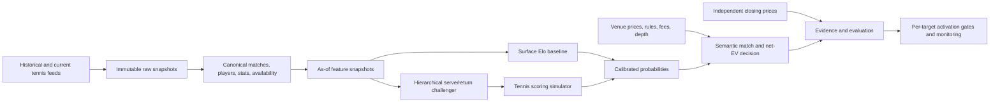
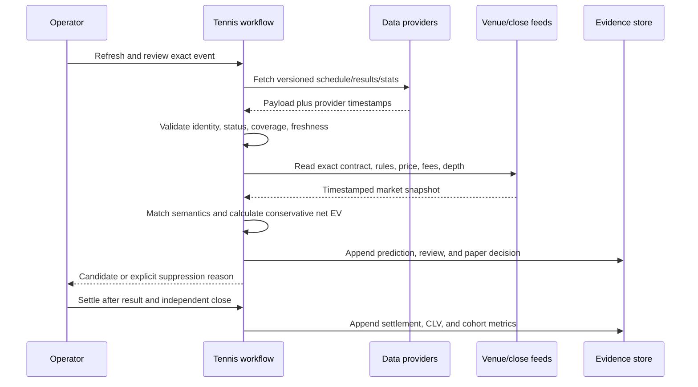
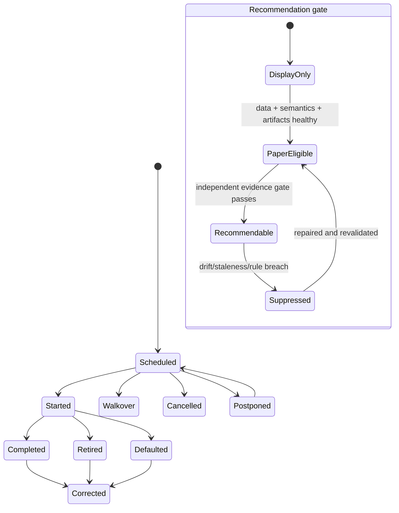
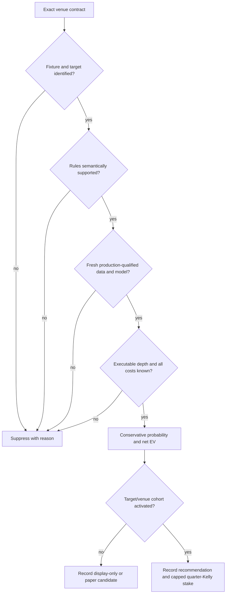

# Tennis Betting Module - Plan

## Goal Capsule

Build professional tennis singles as the next sport in Oracle Bets. The first usable release must ingest reproducible pre-match data, produce calibrated match-winner probabilities, compare them with exact market prices, and accumulate auditable paper evidence without weakening the existing League of Legends workflow. Derivative tennis markets follow only when one tennis scoring model can price them coherently and each target passes its own forward-validation gate.

The product is successful when an operator can refresh tennis data, train and validate a leakage-safe model, review a specific Polymarket, Thunderpick, or Kalshi contract, record a paper decision, settle it under the venue's rules, and measure calibration, closing-line value (CLV), return, and drawdown by independent cohort.

## Product Contract

### Users and jobs

- The primary user is the existing Oracle Bets operator researching and paper-trading quantitative betting strategies.
- The operator needs reproducible probabilities and evidence, not a high-accuracy tip feed.
- The operator needs exact contract semantics, executable prices, costs, and liquidity alongside every candidate.
- The maintainer needs source, model, and market failures to stop recommendations rather than silently degrade them.

### Requirements

- **R1 — Initial competition scope.** Support ATP and WTA singles plus Challenger singles where the selected production feed supplies complete results and statistics. Exclude ITF, doubles, and live betting from the initial product.
- **R2 — Pre-match information boundary.** Every training feature and market decision must be reconstructable as of its recorded availability or quote timestamp. Match-end statistics become usable only after that match reaches a validated terminal state.
- **R3 — Research/production source separation.** Free datasets may bootstrap research and tests, but only a source whose license permits the intended use and whose retention/correction terms are recorded may qualify a real-money cohort.
- **R4 — Reproducible ingestion.** Store immutable raw snapshots, source identifiers, observation times, availability times, source version/provenance, coverage flags, and correction history. Re-running normalization from one snapshot must reproduce the same canonical rows.
- **R5 — Tennis identity and status integrity.** Canonicalize players, tournaments, seasons, surfaces, draws, and matches without name-only joins. Distinguish scheduled, started, completed, retired, walkover, defaulted, cancelled, and postponed states; quarantine impossible scores or ambiguous identities.
- **R6 — Winner baseline.** Produce symmetric, calibrated match-winner probabilities from a surface-aware Elo or Bradley–Terry baseline, with separate reporting by tour, surface, tournament tier, best-of format, and favorite band.
- **R7 — Coherent derivative pricing.** Derive set winners, exact set score, total sets, game totals, game/set handicaps, per-set game totals, and tie-break probability from one point-to-match scoring distribution rather than unrelated target regressions.
- **R8 — Challenger models earn inclusion.** A hierarchical serve/return model, gradient booster, or ensemble may replace or augment the baseline only after forward proper scores, calibration, and CLV improve on untouched windows. Classification accuracy alone is not an acceptance metric.
- **R9 — Market acquisition.** Review only exact event/market links or provider identifiers. Capture outcome/line, bid/ask or quoted odds, available depth when observable, quote timestamp, close timestamp, rules text or hash, fee schedule, and venue. Broad text search may discover candidates but cannot authorize a comparable bet.
- **R10 — Venue-specific semantics.** Compare or pool contracts only when participant, event, target, line, timing, retirement/walkover treatment, overtime/tie-break treatment, void/fair-price behavior, and resolution source match. Otherwise mark them `not_comparable`.
- **R11 — Phased target activation.** Match winner is the only recommendable tennis target in phase one. Simulator-derived markets and statistical props remain display-only until each target has an independent evidence cohort and passes its own gate.
- **R12 — Evidence completeness.** Record every eligible scheduled fixture and every reviewed market, including no-bet decisions, missing markets, stale quotes, failures, corrections, and settlements. Evaluation must not condition on bets that won or on events that were convenient to collect.
- **R13 — Economic evaluation.** Compute expected value after vig, spread, venue fees, estimated slippage, and currency/transfer costs. Report log loss, Brier score, calibration, CLV, turnover, ROI, maximum drawdown, and cluster-aware uncertainty; headline win rate is secondary.
- **R14 — Capital safety.** Keep execution paper-only until a target/venue cohort has at least 200 unique completed match clusters, at least 90% eligible-fixture review coverage, 100% result capture for recommendations, healthy calibration, positive median CLV, and a positive lower confidence bound for multiplicity-aware ROI. Derivative/prop activation should normally require 300–500 match clusters because of smaller effective samples and correlated bets.
- **R15 — Conservative sizing.** Show stake suggestions from a conservative probability estimate using quarter Kelly and a configurable cap on aggregate exposure per match. No automated order placement is part of this plan.
- **R16 — Fail-closed operations.** A stale schedule, incomplete snapshot, unresolved player, unsupported rule, missing fee, missing model artifact, distribution drift breach, or semantic mismatch must suppress a recommendation and explain why.
- **R17 — Operator surface.** Deliver the initial tennis workflow through the existing CLI and evidence store. Discord presentation can follow after the CLI paper loop is stable.
- **R18 — Existing product isolation.** Existing LoL commands, model registry, configuration, evidence, and tests must continue to behave unchanged. Tennis owns sport-specific paths, configuration, targets, and market policy.
- **R19 — Research continuation.** Keep a source-and-market registry for CS2 and future sports, but do not create a generic multi-sport framework or implement CS2/NBA adapters in this work.

### Acceptance examples

- **AE1 — Valid winner review.** Given a completed tennis model snapshot and an exact pre-match Polymarket match-winner URL, the workflow records both competitors, the executable side price and depth, current sports fee parameters, model probability, conservative probability, net EV, sizing suggestion, and a paper no-bet/bet decision.
- **AE2 — Leakage rejection.** Given a match at 12:00 and a ranking or prior-match statistic first observed at 14:00, training and inference exclude that value for the 12:00 decision even if the source later backfills it.
- **AE3 — Retirement mismatch.** Given otherwise identical match-winner contracts whose retirement rules differ, the workflow preserves both rule snapshots and refuses to aggregate their CLV or returns under one comparable cohort.
- **AE4 — Unsupported prop.** Given a Thunderpick fastest-serve or first-break line without licensed historical event data and reproducible settlement, the workflow may display it but cannot emit a recommendation.
- **AE5 — Coherence.** Given one player pair and ruleset, simulated match-winner, set-score, total-set, and game-handicap probabilities reconcile within a documented numerical tolerance.
- **AE6 — Source outage.** Given an incomplete provider response or an expired licensed snapshot, the daily tennis workflow records the failure and produces no recommendation from stale fallback data.
- **AE7 — Selection-bias defense.** Given ten scheduled matches but prices for only six, the evidence report counts ten eligible fixtures, six reviewed markets, four missing-market outcomes, and all later results.
- **AE8 — LoL regression safety.** Given the pre-existing LoL test fixtures and CLI operations, adding tennis changes neither their outputs nor their state paths.

### Key product decisions

1. **Tennis singles is the next implemented market** and CS2 remains the next research candidate. Governs R1, R19. *(session-settled: user-directed)*
2. **The initial product is pre-match only; completed-match statistics are allowed with strict availability timing.** Governs R2. *(session-settled: user-directed)*
3. **Non-winner markets are part of the product, but recommendation eligibility is earned target by target.** Governs R7, R11, R14. *(session-settled: user-directed)*
4. **Thunderpick, Polymarket, and Kalshi are target venues, with Thunderpick allowed as exact-link/manual input when no supported public API exists.** Governs R9, R10. *(session-settled: user-directed)*
5. **Durability and calibrated net expected value take priority over raw prediction accuracy or early betting volume.** Governs R6, R8, R12–R15. *(session-settled: user-approved)*

## Context and Research

### Repository findings

- `packages/oracle-bets-core/src/oracle_bets_core/evidence/` already owns append-only fixtures, predictions, candidates, proposals, bets, settlements, CLV, calibration, drawdown, and fixture-cluster bootstraps. Tennis should reuse these contracts and extend them only where a provider-neutral field is missing.
- `packages/oracle-bets-core/src/oracle_bets_core/betting.py` and `probabilities.py` already own odds conversion, EV, Kelly, and line-probability math.
- `packages/oracle-bets-core/src/oracle_bets_core/markets.py` has a public Polymarket Gamma/CLOB integration and strict exact-link matching, but its market enum and semantics are LoL-shaped.
- `packages/oracle-bets-core/src/oracle_bets_core/paths.py` and `config.py` are nominally core but contain LoL-specific state/config assumptions. Tennis must not reuse their LoL registry paths or expand this work into a broad configuration refactor.
- `packages/lol-bets/src/lol_bets/` demonstrates the intended sibling-package boundary and the immutable-generation, quality-gate, model-registry, daily-workflow, and independent-target-readiness patterns.
- `docs/roadmap.md` already blocks real money until 200 unique fixture clusters, 90% review coverage, 100% result capture, calibration, positive CLV, and a positive multiplicity-aware ROI lower bound. R14 preserves that bar and raises the expected sample for correlated derivatives.

### Tennis data-source decision matrix

| Role | Preferred source | Coverage and value | Constraints and product treatment |
|---|---|---|---|
| Research bootstrap | Jeff Sackmann ATP/WTA repositories | Match results, rankings, and many match statistics across decades; useful for Elo, temporal validation, and reproducible fixtures | CC BY-NC-SA; incomplete fields and historical gaps. Record the license and never let this adapter satisfy the production-license gate. |
| Production schedule/results/stats | Sportradar Tennis v3 or an equivalent licensed official feed | Stable IDs, schedules, profiles, rankings, results, match statistics, coverage metadata, and point-by-point on covered tiers | Contract must permit intended analytics, retention, and wagering-related use. Confirm historical extraction, correction SLA, WTA/Challenger coverage, and retirement/walkover states before activation. |
| Independent close/line history | Betfair historical/API or a licensed multi-book odds feed | Timestamped market prices and a closing benchmark independent of target venues | Persist bid/ask or price depth, not only last trade. Verify sport/market retention and redistribution rights. |
| Lower-cost odds fallback | The Odds API | Current and historical tennis prices where the subscribed plan exposes them | Verify exact tennis market keys, snapshot depth, prop history, rate limits, and license before treating it as complete. |
| Target prices | Polymarket public Gamma/CLOB; Kalshi public catalog plus authenticated read-only orderbook; Thunderpick exact-link/manual capture | Prices actually available to the operator | Polymarket and Kalshi require order-book/fee-aware executable prices. Thunderpick has no relied-upon public API, so scraping and automated execution are out of scope. |

Sackmann reports ATP results from 1968 onward, ranking history that is mostly complete from 1985, tour-level statistics generally from 1991, Challenger statistics from 2008, and qualifying data from 2011, with documented gaps. This is excellent bootstrap material but its non-commercial share-alike license makes it a poor sole production dependency.

Sportradar v3 currently documents ATP, WTA, Challenger, UTR, and team competitions with tier-specific statistics and point-by-point coverage. Its historical endpoints are not a substitute for a contracted historical archive: the ordinary season catalog has a rolling window, while some player histories reach approximately 2007. ITF coverage ended for new events in 2025, reinforcing R1's initial exclusion.

### Venue and market snapshot — 2026-09-06

Market menus, liquidity, limits, fees, and jurisdictional availability change. These observations guide adapters and target sequencing; implementation must rediscover and snapshot the exact contract at decision time.

| Venue | Tennis markets observed | CS2 markets observed | Engineering and economics implication |
|---|---|---|---|
| Thunderpick | Match winner; set winner; set/game handicaps; total sets/games; per-set totals; large event menus may include correct score and tie-break markets | Match/map winner; match/map handicaps and round totals; 1X2; pistol-round score; team round totals; same-game combinations; per-map player kills and other player props | Widest prop surface, but exact availability and limits are event/account dependent. Capture manually from exact links with rules and timestamps; margin is embedded in quoted odds. Do not build a scraper dependency. |
| Polymarket | Match winner; completed-match; first/set winner; first-set/match/set totals; game/set handicaps; per-set game totals | Series and map winners; total maps; map handicap; per-map round totals and handicaps | Public discovery and CLOB data are suitable for an adapter. Many derivatives have shallow books, so executable depth and spread matter more than displayed headline liquidity. Current sports takers pay the protocol's category fee; makers are fee-free under the current schedule. |
| Kalshi | Match winner plus multiple game spreads and total-game lines; some events expose total sets | CS2 match winner was verified; broad CS2 props were not | REST exposes market metadata and authenticated read-only access to order books and candlesticks. Preserve fees and unusual no-start/withdrawal/fair-price rules per contract. Do not infer a broad CS2 menu from isolated events. |

At the snapshot, a sampled Thunderpick WTA event exposed more than 180 event-dependent selections and its sampled CS2 event exposed player-per-map kill totals as well as map/round markets. Thunderpick's published terms reserve event- and account-specific maximums and enumerate esports props including first-event and player-stat markets. Therefore the commercial opportunity is real, but historical price availability, limits, and settlement reproducibility—not menu size—decide whether any prop is modelable.

Polymarket's current sports fee formula is `shares × 0.05 × price × (1 − price)` for takers, subject to market parameters; the fee peaks around a 50-cent price. EV must use the actual market fee and order-book fill simulation rather than a fixed bookmaker-margin assumption. Kalshi also charges market-dependent transaction fees and exposes price/depth separately, so its adapter must snapshot the applicable schedule instead of hard-coding one rate.

### Tennis target ladder

| Phase | Targets | Why now / gate |
|---|---|---|
| 1 — foundation | Match winner | Best liquidity, simplest semantic validation, direct calibration target, and prerequisite for proving the data loop. |
| 2 — coherent derivatives | Set/first-set winner, exact set score, total sets, match/per-set game totals, game/set handicaps, tie-break occurrence | All can be derived from the same serve/return point probabilities and tennis rules engine. Each remains display-only until its independent cohort clears R14. |
| 3 — statistical props | Aces, double faults, service breaks, player games won | Add only with licensed coverage, historical lines, rule-complete settlement, and enough price observations. These can be conditionally modeled from opportunity counts and player rates but have higher variance and lower limits. |
| Deferred | Fastest serve, exact game score, next game/point, first break, live markets, doubles, ITF, exotic retirement-sensitive props | Missing reliable pre-match/history inputs, excessive granularity, thin liquidity, integrity risk, or settlement ambiguity outweighs the apparent softness. |

### CS2 data and market continuation

CS2 remains attractive because map pools, vetoes, and team-specific map strengths can expose series favorites that are vulnerable on one map. The next research phase should prefer official/licensed sources:

- GRID Open Access provides official game-server-sourced CS2 data for qualifying independent and pre-revenue projects; commercial and event-level uses remain subject to license and product tier. GRID has exclusive official data for major ESL FACEIT Group competitions from July 2025.
- PandaScore provides fixtures freely and historical/post-game statistics on paid tiers; detailed rounds and event streams depend on higher plans, and third-party odds are a separate product.
- FACEIT's API supplies match/player statistics and demo links for its own ecosystem, not the entire pro scene.
- Abios is a paid alternative for historical/live esports data and odds products.

End-of-map statistics are sufficient for series/map winner, exact series score, total maps, round totals/handicaps, team rounds, player kills, headshots, assists, deaths, and highest-fragger markets. Event-order props such as first kill, first AWP kill, first plant, knife kill, or pistol-round sequence require event-stream history. A named-map price is valid only after the veto confirms that map; a pre-veto mixture is a different contract. HLTV may assist human verification but should not be the production ingestion dependency.

### Video takeaways and skepticism

The first supplied video uses Sackmann data, surface Elo, recent form, head-to-head, and player attributes, then compares tree, random-forest, gradient-boosting, and neural models. Its useful lesson is to begin with surface Elo and demand a chronological tournament holdout. Its reported accuracy is not evidence of a betting edge: the transcript leaves feature timing and orientation unclear and contains an internal arithmetic inconsistency in the showcased tournament result.

The second supplied video's page credits the same Sackmann dataset, but no reliable transcript was available. It is not used as evidence for architecture or expected returns. Neither video supplies audited prices, vig removal, transaction costs, complete eligible-match sampling, CLV, or a reproducible forward betting ledger.

Published comparisons likewise caution against expecting a complicated model to beat prices: multiple tennis models can have similar proper scores to bookmaker-implied probabilities, and large searches over betting rules create data-snooping winners. The plan therefore treats odds as a strong benchmark, freezes hypotheses before evaluation, and separates prediction quality from realized profitability.

## Planning Contract

### Scope boundaries

#### In scope

- A new `tennis_bets` sibling package, tennis-owned configuration and state paths, source adapters, normalization, feature snapshots, models, simulator, market semantics, paper workflow, evidence, health checks, tests, and documentation.
- Research bootstrap from the Sackmann ATP/WTA data with explicit license metadata.
- A contract-driven production feed boundary, with Sportradar Tennis v3 as the preferred provider to qualify before a live adapter is implemented.
- Match-winner paper evaluation on exact Polymarket, Thunderpick, and Kalshi markets.
- Display-only pricing for phase-two derivatives after simulator verification.
- Independent close capture and platform-specific cost/depth handling.

#### Deferred to follow-up work

- Activating simulator-derived markets after enough forward evidence exists.
- Ace, double-fault, break, and player-games prop models after data and line-history qualification.
- CS2 implementation after the tennis winner loop is stable; its next task is a provider/licensing and historical-line proof of concept.
- Discord tennis presentation after CLI operations are reliable.
- Authenticated order placement, auto-betting, and account-limit management.

#### Outside this product's current identity

- Guarantees of profit, tip-selling claims, or optimization for prediction accuracy without prices.
- Circumventing provider terms, geographic restrictions, bookmaker controls, or account limits.
- Scraping Thunderpick or HLTV as a required production dependency.
- Generic abstractions for hypothetical sports not yet implemented.

### Key technical decisions

1. **KTD1 — Add a small sibling package, not a generic sport framework.** `tennis_bets` owns tennis data, features, targets, models, simulation, and policy; `oracle_bets_core` changes only for provider-neutral contracts used immediately by both sports. This follows the existing LoL boundary and avoids speculative abstractions. Covers R17–R19. *(session-settled: user-approved — chosen over a generalized multi-sport architecture: tennis is the only implementation now and the current core still contains LoL assumptions.)*
2. **KTD2 — Keep research and production data readiness separate.** The Sackmann adapter enables development and reproducible tests but cannot set `production_ready`; a licensed adapter plus stored rights/coverage metadata is required for that state. Covers R3–R5. *(session-settled: user-approved — chosen over treating a popular public dataset as production data: its license and gaps do not support that claim.)*
3. **KTD3 — Use immutable as-of snapshots with explicit availability time.** Normalize from versioned raw payloads and construct features from records whose availability precedes the decision timestamp. Corrections create new snapshots rather than rewriting history. Covers R2, R4, R12.
4. **KTD4 — Ship surface Elo before the point model.** A symmetric surface-aware Elo/Bradley–Terry model is the baseline and operational vertical slice; the hierarchical serve/return model is a challenger and the source of phase-two distributions. Covers R6–R8. *(session-settled: user-approved — chosen over beginning with gradient boosting or a neural model: the transparent baseline exposes leakage and calibration failures sooner.)*
5. **KTD5 — Price derivatives through tennis scoring rules.** Estimate server point-win distributions, then propagate them through game, tie-break, set, and match states by exact dynamic programming where tractable and seeded Monte Carlo where extra random variables require it. Covers R7–R8.
6. **KTD6 — Keep every target and venue as an independent activation cohort.** Winner evidence cannot activate totals, props, or another venue; correlated same-match selections are clustered in uncertainty and exposure. Covers R11–R15. *(session-settled: user-approved — chosen over activating a family of props from one good model report: settlement, liquidity, and error vary by target.)*
7. **KTD7 — Extend market semantics explicitly and preserve existing identity columns.** Add tennis target/rule semantics without renaming the evidence schema's `team_a`/`team_b` columns; those fields carry ordered competitors and tennis payload metadata names them as players. Covers R5, R9, R10, R18.
8. **KTD8 — Use official APIs where available and exact manual review otherwise.** Reuse public Polymarket discovery/CLOB, add a Kalshi catalog plus authenticated read-only order-book adapter, and keep Thunderpick exact-link/manual entry. No venue adapter places orders. Covers R9, R16. *(session-settled: user-directed — chosen over automated Thunderpick scraping: the user chose the venue, but no relied-upon public API supports a stable collector.)*
9. **KTD9 — Benchmark against an independent close.** Prefer Betfair or a licensed multi-book feed for CLV; a target venue close is secondary and never the sole benchmark for the strategy trading there. Covers R12–R14.
10. **KTD10 — CLI first and paper-only.** Tennis enters the existing operator/evidence loop before Discord or execution surfaces. Covers R14–R18. *(session-settled: user-approved — chosen over feature parity on day one: evidence quality, not UI breadth, is the first release risk.)*

### High-level technical design

These sketches are directional boundaries, not prescribed class or function designs.

#### Components and data flow



#### Snapshot-to-decision protocol



#### Match and recommendation lifecycle



#### Candidate decision flow



### Proposed output structure

```text
packages/tennis-bets/src/tennis_bets/
├── __init__.py
├── module.py
├── paths.py
├── ingestion.py
├── features.py
├── modeling.py
├── simulation.py
├── markets.py
└── workflow.py
config/tennis/
├── sources.json
└── product.json
tests/tennis/
├── test_package_structure.py
├── test_paths.py
├── test_ingestion.py
├── test_features.py
├── test_modeling.py
├── test_simulation.py
├── test_markets.py
└── test_workflow.py
```

Keep this tree provisional: combine files when one remains trivial, and do not copy the full LoL directory structure without demonstrated tennis behavior.

## Implementation Units

### U1 — Establish the tennis package and isolated product paths

**Requirements:** R17–R19; KTD1, KTD10.

**Files:** `pyproject.toml`; new `packages/tennis-bets/src/tennis_bets/__init__.py`, `module.py`, `paths.py`; new `config/tennis/product.json`; `tests/tennis/test_package_structure.py`, `test_paths.py`; `packages/oracle-bets-core/src/oracle_bets_core/cli.py`.

**Approach:** Register the sibling source tree and a small tennis command group. Define tennis-owned raw, normalized, feature, artifact, and model-registry paths beneath existing data/state conventions. Expose module health without importing LoL configuration or registry constants. Do not introduce a sport registry, plugin framework, or generic base classes.

**Test scenarios:**

- Importing `tennis_bets` and asking for module health succeeds with valid temporary paths.
- Tennis paths resolve under tennis-specific directories and never equal LoL registry/config paths.
- Missing tennis configuration produces a clear unhealthy result without breaking core or LoL CLI startup.
- Existing core and LoL package/CLI tests remain unchanged and pass.

**Verification outcome:** The repository discovers the tennis package and CLI surface, state is isolated, and no tennis command can mutate LoL artifacts.

### U2 — Build reproducible tennis source ingestion and canonicalization

**Requirements:** R1–R5, R16; AE2, AE6; KTD2, KTD3.

**Files:** new `packages/tennis-bets/src/tennis_bets/ingestion.py`; `config/tennis/sources.json`; `tests/tennis/test_ingestion.py`; small additions to `oracle_bets_core/io_utils.py` only if an existing atomic primitive cannot express the required snapshot write.

**Approach:** Implement a Sackmann bootstrap adapter and a production-feed contract exercised by pinned Sportradar-shaped fixtures. Preserve raw bytes/payload, manifest, checksum, provider observation time, record availability time, coverage tier, license/readiness metadata, and correction lineage. Normalize provider IDs into canonical players, events, surfaces, rulesets, and match states. Publish a generation only after schema, identity, score, chronology, completeness, and duplicate checks pass; quarantine invalid rows with reasons. Add the live Sportradar client only after its commercial-use, retention, history, and correction terms pass the activation questions; until then the production contract remains visibly unqualified rather than being filled by another source silently.

**Test scenarios:**

- Known ATP/WTA/Challenger fixtures normalize to stable canonical IDs across repeated refreshes and spelling variants linked by provider IDs.
- A walkover has no fabricated played points; a mid-match retirement remains distinct from a completed match; a corrected score creates a new generation.
- A match score that violates tennis progression or duplicates a provider match under conflicting identities is quarantined and blocks generation publication.
- A statistic observed after the next match's decision time is unavailable to that decision.
- A Sackmann-only generation is explicitly research-ready but never production-ready.
- Missing credentials, partial pagination, stale payloads, rate-limit exhaustion, and a coverage downgrade fail closed without replacing the last known good generation.

**Verification outcome:** The same raw generation reproduces the same normalized records, invalid source states are observable, and production readiness cannot be obtained from a non-commercial bootstrap source.

### U3 — Produce leakage-safe feature snapshots and the winner baseline

**Requirements:** R2, R6, R8, R12–R14; AE2; KTD3, KTD4, KTD6.

**Files:** new `packages/tennis-bets/src/tennis_bets/features.py`, `modeling.py`; `tests/tennis/test_features.py`, `test_modeling.py`; tennis-specific artifact paths from U1.

**Approach:** Generate one row per scheduled player ordering with only information available at cutoff. The baseline uses overall/surface Elo, inactivity, tour, surface, tournament tier, and best-of format. Ranking, recent form, serve/return aggregates, indoor/outdoor context, age, and defensible travel/rest proxies enter only as named challenger feature sets with coverage reports and ablations. Train a symmetric surface-aware Elo/Bradley–Terry baseline, orient every match both ways, then calibrate on a window between training and untouched scoring windows. Use Platt/logistic calibration for small cohorts and compare isotonic only when calibration samples support it.

**Test scenarios:**

- Swapping player order produces complementary probabilities within numerical tolerance.
- Training through time T cannot read results, rankings, or aggregate updates first available after T.
- A player new to one surface backs off to a documented overall/prior estimate rather than a zero or future statistic.
- Calibration fitting never receives the final evaluation window and serializes its own provenance.
- A constant favorite-heavy predictor may achieve high accuracy but fails proper-score or calibration comparisons, demonstrating that accuracy cannot promote it.
- Rebuilding from identical feature/model snapshots yields identical probabilities.

**Verification outcome:** The winner baseline is reproducible, symmetric, calibrated out of sample, and reports accuracy only alongside proper scores and uncertainty.

### U5 — Add tennis market semantics and venue readers

**Requirements:** R9–R11, R13, R16; AE1, AE3, AE4; KTD6–KTD9.

**Files:** extend `packages/oracle-bets-core/src/oracle_bets_core/markets.py` only for provider-neutral market/evidence fields; new `packages/tennis-bets/src/tennis_bets/markets.py`; `tests/core/test_polymarket_markets.py`; new `tests/tennis/test_markets.py`; tennis configuration in `config/tennis/product.json`.

**Approach:** Define explicit tennis targets and semantic rules. Reuse the Polymarket Gamma/CLOB client for exact links, add Kalshi public-catalog and authenticated read-only orderbook/candlestick parsing, and implement Thunderpick as validated manual input containing exact URL, line, odds, observed time, and rules evidence. Normalize executable prices after walking available book depth; persist venue fee parameters and slippage assumptions. Store retirement, walkover, no-start, tie-break, void, fair-price, and resolution-source semantics in the comparable-market fingerprint.

**Test scenarios:**

- Exact Polymarket tennis markets map each observed `sportsMarketType` and line to the intended internal target; similarly named unrelated markets are rejected.
- Kalshi match-winner, game-spread, game-total, and total-set contracts parse their ticker, strike, rules, bid/ask, size, and fee context; unsupported contracts remain display-only.
- Thunderpick manual review rejects a missing exact link, stale timestamp, incomplete two-sided odds for vig removal, or absent retirement rule evidence.
- Two winner contracts with different retirement/no-start semantics receive different fingerprints and cannot share a cohort.
- A shallow order book turns a positive top-of-book edge into a no-bet once size-weighted fill and fees are applied.
- Existing LoL Polymarket mappings and tests remain unchanged.

**Verification outcome:** Every supported tennis market has an auditable semantic identity and net executable price; uncertain contracts suppress rather than guess.

### U6 — Connect the tennis daily paper loop, settlement, CLV, and activation gates

**Requirements:** R11–R17; AE1, AE6, AE7; KTD6, KTD9, KTD10.

**Files:** new `packages/tennis-bets/src/tennis_bets/workflow.py`; extend `module.py` and `oracle_bets_core/cli.py`; reuse the existing sport/target columns and JSON payload contracts in `oracle_bets_core/evidence/schema.py`, `repository.py`, and `performance.py`; new `tests/tennis/test_workflow.py`; extend relevant `tests/core/test_evidence_repository.py`, `test_settlement_performance.py`, `test_system_health.py` only where cross-sport behavior needs proof.

**Approach:** Orchestrate schedule refresh, artifact selection, inference, exact-market review, semantic validation, net-EV calculation, paper decision, settlement, independent close capture, and cohort reporting. Use the existing append-only evidence fields and payloads; introduce a schema migration only if a required tennis value cannot be represented without weakening query integrity. Record the eligibility denominator before market filtering. Compute conservative EV from a lower probability estimate; show quarter-Kelly with a configured match-level exposure cap. Gate recommendation status by target and venue while reporting surface/tier slices for drift. Cluster resampling by match and tournament/day to reflect correlated derivatives.

**Test scenarios:**

- A complete exact-link winner review appends fixture, prediction, market snapshot, candidate, proposal, and paper decision with linked identities and reproducible economics.
- Ten eligible matches with six venue markets report a denominator of ten and four missing-market outcomes.
- Settlement applies the captured venue rule version for completion, retirement, walkover, and later correction; a correction appends history rather than erasing it.
- Entry-to-close CLV uses the independent feed where available and labels target-venue-only close as secondary.
- Fees, spread, and slippage can reverse gross EV; negative or uncertain net EV yields no recommendation and zero stake.
- A cohort with strong accuracy but poor calibration/CLV cannot activate; a cohort below any R14 evidence threshold cannot activate.
- Multiple positive selections on one match are capped at the aggregate exposure limit and evaluated as one match cluster.
- Stale data, stale quote, unsupported rule, model drift, missing close, or evidence database failure returns a visible suppression/health result.

**Verification outcome:** The CLI supports a complete paper-only tennis lifecycle whose evidence cannot hide missing fixtures, costs, or correlated risk.

### U4 — Add the serve/return model and coherent tennis simulator

**Requirements:** R7–R8, R11, R13; AE5; KTD4, KTD5, KTD6. Begin only after the U1–U3, U5, and U6 match-winner loop can collect prospective paper evidence.

**Files:** extend `packages/tennis-bets/src/tennis_bets/modeling.py`; new `simulation.py`; `tests/tennis/test_simulation.py`; property tests may extend `tests/core/test_property_invariants.py` only for provider-neutral probability invariants.

**Approach:** Estimate time-varying player serve and return point skills hierarchically by surface/tour/tier, with partial pooling for sparse players and uncertainty carried into simulation. Convert server point probabilities through tennis scoring states, including deuce, tie-break, best-of-three/five, and versioned final-set rules. Prefer exact state recursion for score-only targets and seeded Monte Carlo when integrating uncertain latent skills or stat counts. Register the model as a challenger until it beats U3 under R8.

**Test scenarios:**

- Game-win probabilities match analytic edge cases for point probabilities near 0, 0.5, and 1, including deuce termination.
- Match outcome probabilities sum to one; exact-score probabilities reconcile with match winner and total-set distributions.
- Handicap and totals probabilities are monotone as lines move and agree with enumerated score outcomes.
- Best-of-three, best-of-five, ordinary tie-break, and final-set rule fixtures produce the expected reachable states.
- Fixed seeds make Monte Carlo reports reproducible and their sampling error stays below a declared tolerance.
- Sparse/new players yield wider uncertainty and pooled estimates rather than overconfident probabilities.

**Verification outcome:** One validated distribution prices every phase-two market consistently and remains display-only until target-specific evidence activates it.

### U7 — Add operational monitoring and documentation

**Requirements:** R3, R12–R19; KTD2, KTD6, KTD10.

**Files:** `docs/system.md`, `docs/commands.md`, `docs/roadmap.md`, `docs/index.md`; tennis health/reporting code from U1/U6; `tests/core/test_system_health.py`; `tests/tennis/test_workflow.py`.

**Approach:** Document source licenses/credentials, supported scopes, exact command flow, snapshot retention, market semantics, paper gates, bankroll caveats, and recovery procedures. Add health signals for provider age/coverage/corrections, unmatched identities, quarantine rate, feature drift, probability calibration, log loss/Brier, CLV, ROI uncertainty, retirement/void rates, and venue liquidity/fee changes. Report them by ATP/WTA, surface, tier, format, probability band, target, and venue when samples permit. Update the roadmap to make tennis the approved next research track while preserving the LoL activation truth.

**Test scenarios:**

- Health is critical when the production license/coverage manifest, current snapshot, champion artifact, or evidence schema is missing.
- Drift thresholds suppress recommendations without deleting historical evidence and recover only after a validated refresh/retrain.
- Tiny cohort slices are labeled insufficient rather than shown as confident green metrics.
- The documented clean-room operator path reaches paper review without Discord or wagering credentials.
- Existing LoL health and roadmap claims remain accurate.

**Verification outcome:** A maintainer can operate, audit, and stop the tennis loop without tribal knowledge, and the documentation never implies profitability or real-money readiness prematurely.

## Verification Contract

### Model and data validation

- Use expanding or rolling walk-forward folds: train through T, calibrate on the next chronological window, and score the following untouched window. Never use random match splits.
- Freeze source generations, feature cutoffs, model artifacts, market snapshots, and target eligibility before seeing outcomes. Re-run final reports from those immutable references.
- Validate at least one full season spanning hard, clay, and grass before interpreting aggregate results; retain separate ATP/WTA and best-of-five reporting.
- Compare models on log loss, Brier score, calibration intercept/slope and reliability bands. Accuracy and AUC are diagnostic only.
- Benchmark model probabilities against vig-free consensus/independent-close probabilities and the transparent Elo baseline.
- Simulate realized bets using executable bid/ask depth, fees, slippage, and the decision policy that existed at the time; never backfill a more favorable line.
- Use match-cluster and tournament/day block bootstraps for ROI, CLV, and drawdown uncertainty. Correct or account for testing many features, models, thresholds, targets, and venues.
- Run negative controls for player orientation, future rankings/statistics, post-match corrections, duplicated matches, and odds-derived features leaking the evaluation price.

### Paper-capital progression

1. **Shadow research:** bootstrap data, baseline, and simulator tests; no bet labels beyond retrospective research.
2. **Prospective paper collection:** preregister eligible competitions, target, quote timing, and decision thresholds; record all eligible fixtures and no-bets.
3. **Meaningful paper sizing:** only after at least 200 unique match clusters for winner cohorts and normally 300–500 for derivatives, with R14 completeness and uncertainty gates.
4. **Activation review:** manual decision outside this plan after data licensing, jurisdiction, venue access, account constraints, CLV, calibration, and lower-bound ROI remain acceptable.

Even after activation, begin with a small fixed risk budget, quarter Kelly on a conservative probability, and no more than the configured aggregate match exposure. Kelly does not protect against model error; the conservative probability and exposure cap are primary controls.

### Required regression evidence

- All existing core and LoL tests pass without changed expected behavior except explicit provider-neutral schema additions.
- Tennis unit, integration, property, and replay tests pass from pinned source fixtures with no external credentials.
- Optional live-source smoke checks identify themselves, never run as the deterministic test oracle, and fail closed without publishing partial generations.
- If a schema migration becomes necessary, a historical evidence database migrates forward on a copy, preserves row counts and links, and supports rollback by restoring the untouched backup.
- A full paper workflow replay generates identical candidate economics and cohort membership from identical snapshots.

## System-Wide Impact

- **Core contracts:** existing sport/target columns and JSON payloads should carry tennis evidence; likely additions are explicit market semantics and sport-scoped path helpers. Avoid moving tennis logic into core or renaming existing identity fields.
- **Persistent evidence:** prefer no schema migration. If implementation proves a required tennis value needs indexed normal form, use the existing forward-migration and backup pattern with mixed LoL/tennis query tests. Append-only corrections and settlement provenance remain mandatory.
- **CLI:** add tennis commands without changing existing defaults. No Discord or execution parity is required in this phase.
- **Models:** tennis artifacts live in a separate registry with their own feature/source manifests and champion/challenger status.
- **External dependencies:** research works offline from pinned fixtures; production readiness depends on licensed data and independent odds access. Provider outages suppress new decisions but preserve the last good snapshot for audit, not betting fallback.
- **Costs and capacity:** market menus do not imply scalable capital. Track executable depth, rejection/limit observations, fees, slippage, and realized fill assumptions by venue; exclude inaccessible or account-restricted capacity from expected returns.
- **Security and compliance:** credentials stay in the existing environment-secret mechanism and out of snapshots/logs. The operator remains responsible for venue eligibility, tax, and local law; the software must not bypass access controls or terms.

## Risks and Mitigations

| Risk | Consequence | Mitigation |
|---|---|---|
| Historical license is incompatible with commercial use | A promising model cannot legally become a product | Enforce separate research/production readiness and obtain written provider terms before activation. |
| Availability timestamps are reconstructed incorrectly | Severe future-data leakage | Persist observed/available times, use only immutable as-of snapshots, and include adversarial leakage tests. |
| Bookmaker odds or winner/loser orientation leak into features | Artificial accuracy and edge | Keep odds out of the primary model, use symmetric rows, and isolate odds to evaluation/decision stages. |
| Many models/targets create a lucky backtest | Capital is allocated to noise | Preregister cohorts, use untouched walk-forward windows, adjust for multiple searches, and demand CLV plus lower-bound ROI. |
| Retirement and walkover rules differ | Wrong pricing and settlement | Version rule fingerprints per venue and refuse cross-rule comparability. |
| Thin derivative books make displayed prices untradeable | Backtest overstates deployable capital | Walk order-book depth, include spread/fees/slippage, and track capacity by stake band. |
| Bookmakers limit winning accounts or markets | Edge cannot scale despite positive EV | Treat venue/account capacity as a measured outcome; diversify lawful venues and never project paper turnover as deployable capital. |
| Challenger/low-tier integrity and data coverage are weaker | Hidden information, suspicious play, and missing stats raise model error | Restrict initial scope to covered tiers, report by tier, and suppress events failing integrity/coverage policy. |
| Concept drift from surface, equipment, rules, or player state | Calibration and edge decay | Monitor proper scores, calibration, CLV, feature/coverage drift, and retrain on scheduled windows; fail closed on breaches. |
| Complex model obscures a weak edge | Engineering cost rises without economic gain | Keep Elo champion until a challenger wins on forward proper scores and CLV after costs. |

## Open Questions

### Resolved during planning

- Tennis precedes CS2 and NBA; CS2 remains active research, not implementation.
- The first workflow is pre-match and may use only completed historical match statistics.
- Match winner ships first, but the architecture must later price coherent derivatives and selected props.
- Thunderpick is exact-link/manual until a documented, permitted API route exists.
- The initial UI is CLI-only and order placement remains manual/out of scope.

### Must resolve before production activation

- Which licensed tennis data contract meets the required retention, commercial-use, historical-depth, correction, and ATP/WTA/Challenger coverage terms at an acceptable cost?
- Which independent odds source supplies timestamped tennis closes and required derivative history under acceptable retention terms?
- What aggregate match-exposure cap and conservative-probability method will be approved after paper drawdown analysis? The implementation should default to quarter Kelly and a conservative low cap, but activation requires an explicit capital policy.
- Which jurisdictions and accounts make Thunderpick, Polymarket, and Kalshi lawfully and practically available to the operator at activation time?

These are activation blockers, not implementation blockers: the system can remain research/paper-only and must report the missing qualification.

## Definition of Done

- U1–U7 are complete with their stated observable outcomes and regression evidence.
- A fresh checkout can replay pinned tennis fixtures, build leakage-safe features, train/calibrate the Elo baseline, and price an exact match-winner market without network credentials.
- Licensed-source readiness cannot be spoofed by the Sackmann bootstrap adapter or a stale/partial response.
- Polymarket and Kalshi readers plus Thunderpick manual capture preserve exact rules, costs, timestamps, and executable depth assumptions.
- The paper ledger includes all eligible fixtures/no-bets and settles retirement/walkover cases according to captured venue rules.
- Reports separate prediction skill from betting performance and show proper scores, calibration, independent CLV, net ROI uncertainty, drawdown, completeness, and capacity.
- Phase-two markets are coherent with the scoring simulator but remain display-only until their own evidence gates pass.
- LoL behavior and tests remain intact, documentation reflects tennis's paper-only status, and no automated betting path exists.

## Sources and References

### Primary data and API sources

- [Jeff Sackmann ATP data and coverage notes](https://github.com/JeffSackmann/tennis_atp)
- [Jeff Sackmann WTA data](https://github.com/JeffSackmann/tennis_wta)
- [Sportradar Tennis v3 overview](https://developer.sportradar.com/tennis/docs/tennis-ig-overview)
- [Sportradar tennis coverage tiers](https://developer.sportradar.com/tennis/docs/tennis-ig-data-coverage-tiers)
- [Sportradar tennis historical data](https://developer.sportradar.com/tennis/docs/tennis-ig-historical-data)
- [ATP and Sportradar partnership](https://www.atptour.com/en/news/sportradar-atp-partnership-december-2023)
- [Betfair historical data overview](https://www.betfair.com.au/hub/education/how-to-model/historical-data-sources/)
- [The Odds API documentation](https://theoddsapi.com/docs/)
- [Kalshi market API](https://docs.kalshi.com/api-reference/market/get-markets)
- [Kalshi order-book API](https://docs.kalshi.com/api-reference/market/get-market-orderbook)
- [Kalshi candlestick API](https://docs.kalshi.com/api-reference/market/get-market-candlesticks)
- [Kalshi fee guidance](https://help.kalshi.com/en/articles/13823805-fees)
- [Polymarket fees](https://docs.polymarket.com/trading/fees)
- [Polymarket tennis markets](https://polymarket.com/sports/tennis)
- [Polymarket CS2 markets](https://polymarket.com/sports/cs2/games/week/1)
- [Thunderpick tennis](https://thunderpick.io/sports/tennis)
- [Thunderpick terms and special betting rules](https://thunderpick.io/resources/docs/Terms_and_Conditions_Thunderpick.pdf)
- [GRID Open Access](https://grid.gg/open-access/)
- [GRID and ESL FACEIT official-data partnership](https://grid.gg/esl-faceit-grid-esports-data-partnership/)
- [PandaScore plan and data coverage](https://developers.pandascore.co/docs/plan-reference)
- [FACEIT Data API](https://docs.faceit.com/api/data/)
- [Abios esports data API](https://abiosgaming.com/esports-data-api)

### Modeling and research caution

- [A dynamic Bayesian hierarchical model for tennis](https://ideas.repec.org/a/bpj/jqsprt/v15y2019i4p313-325n3.html)
- [Machine-learning tennis predictions compared with bookmaker probabilities](https://doi.org/10.3233/JSA-200463)
- [The statistical reality of profitable sports betting rules](https://www.muni.cz/en/research/publications/1397002)
- [IBIA 2024 sports betting integrity report](https://ibia.bet/wp-content/uploads/2024/06/IBIA-Report-2024_FINAL-TEXT_SINGLE_AW.pdf)
- [Supplied video: I Trained AI to Predict Sports](https://www.youtube.com/watch?v=LkJpNLIaeVk)
- [Supplied follow-up video](https://www.youtube.com/watch?v=N4JDlSTMOck)

### Repository references

- `pyproject.toml`
- `packages/oracle-bets-core/src/oracle_bets_core/markets.py`
- `packages/oracle-bets-core/src/oracle_bets_core/betting.py`
- `packages/oracle-bets-core/src/oracle_bets_core/evidence/`
- `packages/oracle-bets-core/src/oracle_bets_core/paths.py`
- `packages/lol-bets/src/lol_bets/`
- `docs/system.md`
- `docs/commands.md`
- `docs/roadmap.md`
