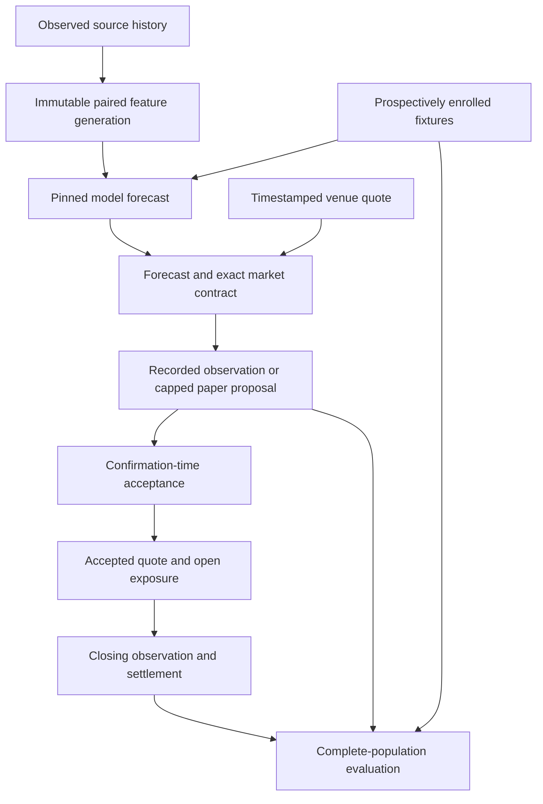
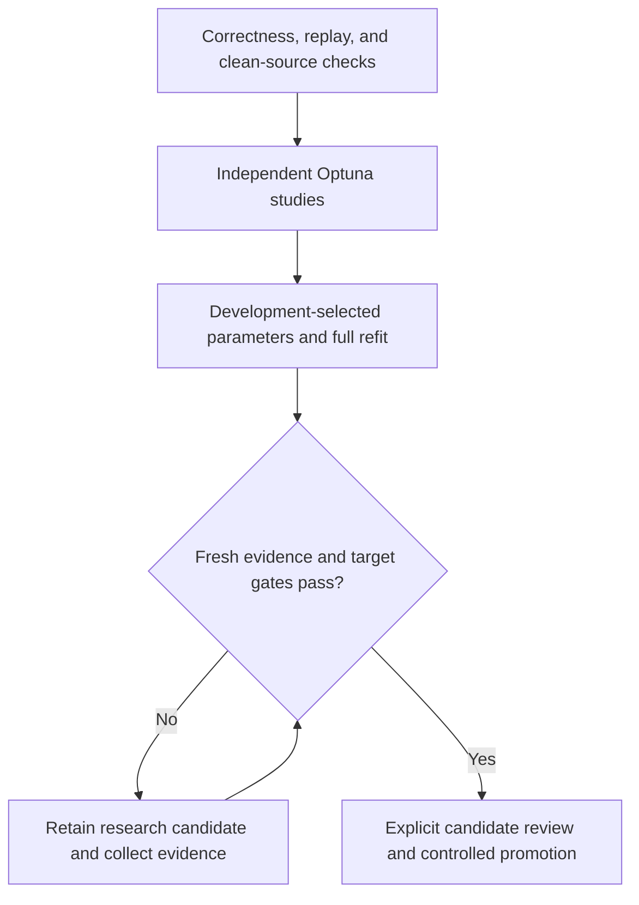

# Paper Testing and Research Readiness - Plan

## Execution checkpoint (2026-10-03)

The implementation passes 716 tests (one skipped), Ruff, and changed-path type checks. The managed Oracle's Elixir source was refreshed and passed `lol source-check` through the October 2 file. Full historical map and series tables were rebuilt and validated; the paired serving snapshot and both training manifests load under the same source and code fingerprint. The daily workflow completed once with the bot running and scheduler registered. No Optuna study, full refit, or complete prospective paper cycle has finished.

| Gate | Status | Next proof |
| --- | --- | --- |
| Quote, ledger, Thunderpick checklist, balanced Kelly, daily separation, and training boundary code | Implemented locally; integrated regression green | Exercise an owner-sourced quote, confirmation, close, and result on the enrolled fixture |
| Training and serving data generation | Rebuilt and validated: 24,329 games, 10,160 accepted series, paired snapshot | Keep generation lineage stable through model training |
| Value-level train/serve replay | Comparator tested; old August candidate correctly rejected as a different training generation | Run against a candidate trained from the rebuilt generation; inspect mismatches and distinguish calculation from prospective availability |
| Fresh search and full refit | Not run | Clean, reviewed source; one independent Optuna study per target; research-only refit; review eligibility without weakening gates |
| Paper launch | Bot live, scheduler registered, Cloud9–LYON enrolled prospectively for October 3 | Obtain exact owner-observed Thunderpick/Polymarket markets; capture, compare, confirm if positive edge, then close/result/report |
| Tennis | Not started | Reuse the proven paper workflow after the LoL cycle and evidence assessment |

The immediate order is **review the source and resolve the clean-source gate → run the fresh studies and refit → replay the resulting candidate → complete the prospective paper cycle → start tennis**. The October 3 cohort can collect observation evidence in parallel. A source edit after data publication invalidates its code fingerprint and requires rebinding or rebuilding as appropriate. The earlier no-commit instruction remains in force; clean-source training preflight therefore needs an explicit source-commit decision after the implementation is reviewable. A no-change daily run still recomputes historical features and took roughly 30 minutes; profile and safely skip only when source, transform, and output evidence all match.

## Goal Capsule

**Objective:** The owner can run credible LoL paper tests, compare Thunderpick markets, and assess model and staking performance before expanding to tennis.

**Means:** Finish the correctness and evidence boundaries, collect prospective market evidence, and run fresh Optuna studies followed by full retraining (KTD1–KTD7).

**Authority:** User decisions and repository instructions govern this plan. Preserve the existing authorized changes and the unrelated tennis plan. Implementation owns integration, verification, and a reviewable local result; commits and publication remain subject to the user's existing restriction.

**Stop conditions:** Do not bypass source provenance, invent unavailable quotes or historical availability, relabel exposed tests as fresh, or activate a failing model or strategy. A blocked promotion does not block research artifact creation or observation collection.

---

## Product Contract

### Summary

Complete the agreed operational and research fixes, make map/prop/handicap comparison against Thunderpick a required research workflow, and use balanced fractional Kelly for paper sizing. Start evidence collection as soon as its integrity checks pass; run the large training exercise after the training correctness fixes.

### Problem Frame

The current implementation has useful model, market, and ledger components, but temporal provenance and coverage gaps prevent defensible claims about profitability. Daily maintenance has also been coupled to training. Historical test exposure, timing, and accepted-only records can make apparent progress look stronger than the evidence supports.

### Key Decisions

- **Mandatory additional markets.** Governs R5. (session-settled: user-directed — chosen over deferring map/prop/handicap research: the user wants these opportunities investigated now.)
- **Balanced Kelly research.** Governs R6. (session-settled: user-directed — chosen over flat sizing or maximum-growth sizing: the user accepts some drawdown in exchange for growth.)
- **Fresh Optuna and full retraining after fixes.** Governs R8. (session-settled: user-directed — chosen over a fixed-parameter-only refit: the user requested a broad new search after correctness is repaired.)

### Requirements

**Operations and forecast correctness**

- R1. Daily maintenance refreshes and validates data, schedules, and health independently of explicit training, with visible failures and no overlapping writers.
- R2. Every new forecast identifies one pinned model bundle and one immutable paired feature generation, with raw and calibrated probabilities and actual decision and generation timestamps.
- R3. Serving uses only completed-match state available by the decision cutoff, and candidate eligibility requires value-level train/serve replay evidence rather than availability labels alone.

**Markets, evidence, and sizing**

- R4. Quotes, accepted paper bets, closing observations, and results have explicit traceable references and actual timestamps. Legacy records retain their contents and hashes and remain distinguishable from new prospective evidence.
- R5. Map winners, supported props, totals, and handicaps must be compared with captured Thunderpick lines using exact market periods, selections, lines, and settlement terms. Unsupported or unverified contracts remain visible with reasons.
- R6. Paper tickets use positive-edge fractional Kelly with ticket, sporting-fixture, and total-open-exposure caps. Select a balanced policy on development evidence and assess the locked choice on later evidence; negative-edge cases remain observations without flat stakes.
- R7. Preregister a reproducible fixture population before forecasts or prices are inspected. Report all enrolled fixtures, missing markets, rejected opportunities, missing closes, and unresolved results alongside accepted bets.

**Research and expansion**

- R8. Run fresh independent Optuna studies for all current supported model targets, then a full refit, after temporal preprocessing, input provenance, holdout exposure, and replay issues are fixed.
- R9. Training completion, parameter review, candidate review, and serving promotion are separate outcomes. Insufficient fresh evidence produces an explicit research-only result and leaves the champion unchanged.
- R10. Keep the operational console and shared interfaces clear enough to add tennis, with scoped LoL ownership cleanup and measured runtime improvements.

### Scope Boundaries

This plan covers the previously accepted audit actions, existing winner/map/prop targets, market comparison, portfolio research, and paper readiness. It does not assert that extra markets are easier to beat.

Large infrastructure replacement, cloud services, accounts, billing, public APIs, and a public product remain deferred. FireDucks changes require an awake profile and correctness parity first. Additional model families require evidence that current models miss a material signal.

Tennis follows the existing `docs/plans/2026-09-06-0050-feat-tennis-betting-module-plan.md` after the shared paper workflow is verified. Preserve that document unchanged during this work; its full implementation is a separate workstream.

### Acceptance Examples

- AE1. A decision made at noon excludes both an 18:00 match and an 11:50 match still in progress. A feature generation published tomorrow cannot be presented as available today. Covers R2–R3.
- AE2. A confirmation made after fixture start or against an expired quote fails for prospective paper entry. An explicitly retrospective real record remains identifiable as such. Covers R4.
- AE3. A negative-edge map quote remains in the research population with zero proposed stake. Several positive-edge tickets on one fixture share an exposure cap. Covers R5–R7.
- AE4. A full training run finishes but lacks fresh holdout evidence; its artifacts and diagnostics are retained without champion replacement. Covers R8–R9.

---

## Planning Contract

### Key Technical Decisions

- KTD1. **Reuse the current workflow and append-only store.** Extend existing journals, corrections, and SQLite migrations. Use nullable foreign-key references for historical rows and validate the migration on a database copy before touching the working database. Governs R1, R4.
- KTD2. **Publish paired feature histories atomically.** Retain historical after-match states with a match-completion lower bound and a separate generation observation time. Bind feature, source, and code hashes. Pin the generation once for both teams; missing historical availability is a limitation, never an inferred timestamp. Governs R2–R3.
- KTD3. **Fit preprocessing inside temporal folds.** Feed raw development frames to each inner fold, fit transformations on that fold's training rows, and cache transformed folds across trials. Hash the actual input tables and verify their generation lineage before fitting. Governs R3, R8. This follows the leakage boundary in [scikit-learn's preprocessing guidance](https://scikit-learn.org/stable/common_pitfalls.html#data-leakage).
- KTD4. **Retain test-exposure history independently of report cleanup.** Inventory previously exposed model and tuning evaluations; unknown exposure cannot establish freshness. Reserve explicit temporal cutoffs and keep development optimization separate from the untouched future evaluation. A research-only full refit may use development-selected parameters without mislabeling them reviewed or promotable. Governs R8–R9.
- KTD5. **Use provider-specific capture with controlled semantics.** Thunderpick currently accepts owner-entered lines through `manual_market.py`; a URL alone supplies no odds. Extend that workflow for required targets and batch capture. Investigate an authorized reliable feed separately; do not assume one exists or substitute another provider. Persist verified terms and capture provenance before allowing cross-provider equivalence. Governs R4–R5.
- KTD6. **Use settlement-aware portfolio evaluation.** Reuse `evidence/portfolio.py` for capped fractional Kelly and temporal replay. Use stable sporting-event identity across schedule revisions and retain unsettled exposure. Use joint expected-log optimization only with supported joint scenarios; otherwise apply explicit exposure caps without assuming market independence. Governs R6–R7. [Risk-constrained Kelly research](https://web.stanford.edu/~boyd/papers/kelly.html) motivates evaluating growth and drawdown together; it does not establish that these local defaults are optimal.
- KTD7. **Enroll an observable fixed population before inference.** Persist the scheduled fixture list for a declared horizon and policy before forecasting. Add later-discovered fixtures as separate prospectively enrolled cohorts. Cohort membership and sporting-event identity survive schedule revisions. Missing and failed stages remain in denominators. Governs R7.

### Assumptions and Execution-Time Prerequisites

- The implementation's provisional quarter-Kelly, 2% ticket, 5% fixture, and 20% total-open-exposure limits are research defaults, not user-selected numerical limits or validated optimums. Compare eighth, quarter, and half Kelly under the same declared balanced-risk objective before adopting a winner.
- The research module's current drawdown preference and evidence minimums are provisional evaluation settings. Freeze them before examining policy-comparison results; report sensitivity rather than adjusting limits until a preferred policy passes.
- Fresh market history and fresh model holdout coverage may be insufficient immediately. Observation collection and research-only fitting proceed; activation waits for evidence.
- Registered training currently requires a clean Git worktree, including untracked files. After the code is concrete and reviewed, resolve the user's earlier no-commit restriction before creating a scoped source commit and a clean training checkout. Do not remove or hide the tennis plan, train old HEAD, or weaken the provenance check.
- Before live rollout, inspect current maintenance processes and locks anew. A process observed during earlier work is not assumed still running.

### Data Flow

### Research and Promotion Flow

### Implementation Order

Finish U1–U3 first. U4 starts observation collection once U2–U3 pass; it does not wait for a new champion. U5–U6 establish valid sizing and training evidence. U7 executes research and retraining after its prerequisites. U8 verifies the owner workflow and prepares the tennis handoff.

---

## Implementation Units

### U1. Finish maintenance separation and measure runtime

**Goal:** Make daily operation predictable and diagnosable. **Requirements:** R1, R10. **Dependencies:** None.

**Files:** `packages/lol-bets/src/lol_bets/daily.py`, `packages/lol-bets/src/lol_bets/pipeline.py`, `packages/lol-bets/src/lol_bets/data_generation/ingestion/schedule.py`, `packages/oracle-bets-core/src/oracle_bets_core/cli.py`, `docs/commands.md`, `tests/lol/test_daily_workflow.py`, `tests/lol/test_daily_robustness.py`, `tests/core/test_operational_cli.py`.

**Approach:** Integrate the existing removal of daily training. Complete per-response observation clocks and per-stage wall/CPU timing, retain independent health reporting, and make scheduled-job failures visible. Profile one awake run before selecting optimizations; permit a no-change shortcut only when inputs, transformation version, and output integrity agree. Follow the current workflow journal and lock patterns.

**Test scenarios:**

1. Refresh failure still produces champion health and a failed workflow result.
2. Long maintenance advances schedule, lineup, and quote observation times.
3. A concurrent writer is refused without deleting its lock.
4. A changed transform or missing artifact prevents a no-change shortcut.

**Verification:** Focused workflow and CLI tests pass with temporary lock/database roots. An awake profile identifies stage costs without treating sleep as CPU time.

### U2. Complete feature snapshots and train/serve replay

**Goal:** Make forecast inputs reproducible at the decision boundary. **Requirements:** R2–R3, AE1. **Dependencies:** U1 for publication integration.

**Files:** `packages/lol-bets/src/lol_bets/inference/snapshots.py`, `packages/lol-bets/src/lol_bets/inference/team.py`, `packages/lol-bets/src/lol_bets/inference/match_predictor.py`, `packages/lol-bets/src/lol_bets/pipeline.py`, `packages/lol-bets/src/lol_bets/daily.py`, `packages/lol-bets/src/lol_bets/operations/models.py`, `tests/lol/test_feature_snapshots.py`, `tests/lol/test_team_lookup.py`, `tests/lol/test_match_predictor_inference_features.py`, new `tests/lol/test_serving_replay.py`.

**Approach:** Finish the current snapshot implementation under KTD2. Pin raw-source lineage and the feature generation together with the model; persist actual raw ensemble output separately from calibrated and component probabilities. Compare reconstructed canonical training features with serving features at declared cutoffs. Historical reconstruction can validate calculations, but cannot manufacture prospective source availability.

**Execution note:** Start with regressions for temporal boundaries and a value-level replay mismatch.

**Test scenarios:**

1. Covers AE1, including naive and timezone-aware timestamps.
2. Publication failure preserves the previous paired generation; corruption fails closed.
3. A champion or feature-pointer change during inference does not mix artifacts.
4. Team-order reversal complements raw and calibrated probabilities consistently.
5. Replay detects changed feature values even when feature names and labels match.

**Verification:** Snapshot, inference, and replay tests pass; replay evidence binds code, source, feature, and model identifiers.

### U3. Finish quote-to-bet and closing provenance

**Goal:** Preserve the complete evidence chain without backdating prospective paper entries. **Requirements:** R4, AE2. **Dependencies:** U2.

**Files:** `packages/oracle-bets-core/src/oracle_bets_core/evidence/schema.py`, `packages/oracle-bets-core/src/oracle_bets_core/evidence/repository.py`, `packages/oracle-bets-core/src/oracle_bets_core/operations/bets.py`, `packages/lol-bets/src/lol_bets/operations/evidence.py`, `packages/lol-bets/src/lol_bets/operations/manual_market.py`, `packages/oracle-bets-discord/src/oracle_bets_discord/ui/bets.py`, `tests/core/test_evidence_repository.py`, `tests/core/test_bet_evidence.py`, `tests/lol/test_daily_evidence_recording.py`.

**Approach:** Finish and verify the additive schema references already being introduced. Enforce actual confirmation time, current quote identity, quote freshness, compatible terms, and declared size/cost basis in the recording service. Refresh Polymarket quotes through the existing confirmation-book capture path; require a new owner observation when a Thunderpick quote is stale. Preserve the fixture and selection through quote recapture, then recalculate the proposal and stake before confirmation. Record closing observations separately from settlement entry and only calculate comparable CLV. Follow append-only corrections rather than rewriting old facts.

**Test scenarios:**

1. Covers AE2 through the actual confirmation callback and service; a stale quote returns to capture and produces a newly priced and sized proposal.
2. Quote references from another selection, fixture, or contract are rejected.
3. Closing odds at or below one, late closing observations, and mismatched terms cannot generate valid CLV.
4. Migration on a populated legacy copy preserves row counts, old fields, content hashes, and foreign-key integrity.
5. A retried confirmation is idempotent without bypassing the original immutable accepted record.

**Verification:** Migration-copy checks and ledger integration tests pass before a backed-up live migration.

### U4. Make Thunderpick research and complete cohorts operational

**Goal:** Collect usable evidence for every required market family and every enrolled fixture. **Requirements:** R5, R7, AE3. **Dependencies:** U2, U3.

**Files:** `packages/lol-bets/src/lol_bets/operations/manual_market.py`, `packages/lol-bets/src/lol_bets/operations/market_actions.py`, `packages/lol-bets/src/lol_bets/operations/market_validation.py`, `packages/lol-bets/src/lol_bets/operations/evidence.py`, `packages/oracle-bets-core/src/oracle_bets_core/operations/bets.py`, `packages/oracle-bets-core/src/oracle_bets_core/evidence/performance.py`, `tests/lol/test_manual_market_review.py`, `tests/lol/test_daily_market_actions.py`, `tests/lol/test_market_strategy_validation.py`, `tests/core/test_cohort_evidence.py`.

**Approach:** Connect the existing controlled Thunderpick input and target transforms to an explicit required-target capture checklist and complete research report. Show captured, missing, and unsupported targets in the existing Discord review flow (`packages/oracle-bets-discord/src/oracle_bets_discord/ui/review.py`), including after finishing a review. Enroll before inference per KTD7; add missing-market, rejected, missing-close, and unresolved-result stages. Use exact line/period semantics and explicit distribution limitations for handicaps and props. Report model scoring separately from market EV, net returns, CLV, costs, and coverage; model-only backtests cannot establish a betting edge.

**Test scenarios:**

1. Map 1 and series winner, different handicap lines, and different grading rules never merge.
2. Missing venue access or unsupported markets remain in coverage denominators.
3. Enrollment after existing forecasts or prices fails; fixture rescheduling preserves sporting-event grouping.
4. Over/under, pushes, voids, and handicaps grade against the captured contract.
5. A report contains all enrolled fixtures and both provider comparisons and missing-data reasons; review callbacks preserve the visible captured/missing/unsupported checklist.

**Verification:** One owner workflow produces linked forecast, quote, comparison, result, and coverage outputs. Collection can continue with no accepted tickets and no new model promotion.

### U5. Integrate balanced Kelly and portfolio selection

**Goal:** Replace the primary flat/full-Kelly paths with auditable capped fractional sizing. **Requirements:** R6–R7, AE3. **Dependencies:** U3, U4 for evidence-backed selection.

**Files:** `packages/oracle-bets-core/src/oracle_bets_core/evidence/portfolio.py`, `packages/lol-bets/src/lol_bets/operations/market_strategies.py`, `packages/oracle-bets-core/src/oracle_bets_core/operations/bets.py`, `packages/oracle-bets-core/src/oracle_bets_core/cli.py`, `packages/oracle-bets-core/src/oracle_bets_core/config.py`, `config/product/product.json`, `packages/oracle-bets-discord/src/oracle_bets_discord/ui/presentation.py`, `tests/core/test_portfolio_research.py`, `tests/lol/test_market_decisions.py`, `tests/core/test_bet_evidence.py`.

**Approach:** Integrate the existing research allocator at both proposal and final acceptance. Recompute caps against same-mode, same-currency open positions; serialize acceptance so simultaneous tickets cannot overspend a shared cap. Build research inputs from the complete population in U4 with net executable odds and stable fixture IDs. Persist a selected policy before later evaluation; insufficient evidence leaves the declared provisional default clearly labeled. Historical flat paths may remain diagnostic fields but are never the selected strategy.

**Test scenarios:**

1. Covers AE3 and concurrent acceptance against a shared fixture/global cap.
2. Unsettled stakes remain reserved; settlement releases them at its actual timestamp.
3. Changing heldout results cannot change the development-selected policy.
4. Currencies and paper/real portfolios never share budgets or P&L.
5. Missing evidence returns unavailable/insufficient evidence, never an optimal-policy claim.

**Verification:** Numerical tests and a full paper confirmation-to-settlement replay agree on stakes, reserved exposure, growth, and drawdown.

### U6. Repair training research boundaries

**Goal:** Make the upcoming search and full refit scientifically interpretable. **Requirements:** R3, R8–R9. **Dependencies:** U2.

**Files:** `packages/lol-bets/src/lol_bets/prediction_models/gbdt_model.py`, `packages/lol-bets/src/lol_bets/prediction_models/winner_model.py`, `packages/lol-bets/src/lol_bets/training.py`, `packages/lol-bets/src/lol_bets/operations/models.py`, `packages/lol-bets/src/lol_bets/operations/provenance.py`, `tests/lol/test_winner_model.py`, `tests/lol/test_training_provenance.py`, `tests/lol/test_training_targets.py`, new `tests/lol/test_holdout_exposure.py`.

**Approach:** Apply KTD3–KTD4. Keep calibration fitting, calibration selection, uncertainty estimation, and final evaluation disjoint. Persist actual table hashes and verify team/player/series generation consistency. Preserve exposure records and failed evidence despite report retention. Give map/prop parameters honest target-specific review status; add a research-only full-refit route when fresh promotion evidence is unavailable.

**Test scenarios:**

1. Later-fold category or missingness changes cannot alter an earlier fold's fitted preprocessing.
2. Changing the raw pointer or a training table between preflight and fit fails provenance checks.
3. Previously exposed intervals remain exposed after report cleanup; unknown history cannot pass freshness.
4. Final-test changes do not alter schema, parameters, blend, calibration selection, or staking policy.
5. Missing replay or target-specific review blocks eligibility without deleting research outputs.

**Verification:** Temporal-boundary and provenance tests pass. A small isolated smoke run establishes the full artifact contract before the costly search.

### U7. Execute fresh Optuna and full retraining

**Goal:** Produce the requested comprehensive new model artifacts with reviewable evidence. **Requirements:** R8–R9, AE4. **Dependencies:** U1, U2, U6; clean-source authorization prerequisite.

**Files:** `packages/lol-bets/src/lol_bets/training.py`, `packages/oracle-bets-core/src/oracle_bets_core/cli.py`, `docs/commands.md`; generated research reports and model candidates remain in their existing artifact locations.

**Approach:** Execute independent studies through the existing research orchestration for series winner, map winner, game length, kills, and towers. The current default is 100 trials per target; record the actual budget, seed, runtime, resource use, input hashes, and selected parameters. Review each target, perform the full refit, and review the resulting complete bundle. Preserve the champion unless its promotion gates pass. Resolve source-commit permission only after all source changes are concrete and reviewed.

**Test scenarios:**

1. Covers AE4.
2. An interrupted study resumes or fails explicitly without overwriting the champion or discarding its evidence.
3. A full bundle includes every configured target and its calibration/uncertainty artifacts.
4. Parameter lineage names each target's actual study and review status.

**Verification:** All requested target studies and the full refit have retained completion or failure reports. Model eligibility is supported by the existing quantitative gates plus U2/U6 evidence; no gate is reduced to obtain promotion.

### U8. Verify paper launch and prepare tennis reuse

**Goal:** Let the owner operate the complete workflow and move to tennis without carrying LoL-specific assumptions into shared code. **Requirements:** R1–R10. **Dependencies:** U1–U6; report U7 outcome when available.

**Files:** `packages/oracle-bets-discord/src/oracle_bets_discord/ui/presentation.py`, `packages/oracle-bets-discord/src/oracle_bets_discord/ui/bets.py`, `packages/oracle-bets-core/src/oracle_bets_core/paths.py`, `packages/oracle-bets-core/src/oracle_bets_core/config.py`, LoL module-owned path/taxonomy surfaces, `tests/core/test_operational_cli.py`, `tests/core/test_bet_evidence.py`, new `tests/core/test_paper_workflow.py`, `docs/commands.md`.

**Approach:** Distinguish artifact health, source freshness, exploration availability, and recommendation eligibility in the console. Exercise callbacks rather than only widget construction. Move only the LoL path/taxonomy ownership needed for tennis reuse, preserving existing serialized artifact loading. Activate and verify the current local scheduler after tests and model/data preflight, then capture a real prospective cycle without placing real bets. Keep the existing tennis plan intact and identify its now-satisfied prerequisites.

**Test scenarios:**

1. Schedule → forecast → both-provider review → capped paper confirmation → close/result → report works across the actual service boundaries.
2. Missing fresh data or quotes produces an actionable explanation and no misleading recommendation.
3. One fixture's failure does not erase peers or cohort membership.
4. Existing model bundles still load after scoped ownership changes.

**Verification:** Full regression, Ruff, and type checks pass. The owner can inspect one complete paper cycle and the report's missing-data coverage. Record an assessment of the available model and staking evidence before the tennis handoff, explicitly stating insufficient evidence where applicable. Tennis can begin once the shared workflow is proven and that assessment is recorded; it need not wait for profitable returns or a model promotion that lacks fresh evidence.

---

## Verification Contract

| Area | Required evidence |
|---|---|
| New behavior | Targeted pytest regressions in each unit's listed test files, with failing reproductions for the discovered defects |
| Integrated code | Full pytest suite, `ruff check`, and `ty check` after integration; tests use temporary databases, locks, and report roots |
| Migration | Populated database-copy migration, old-row/hash comparison, SQLite integrity and foreign-key checks, and preserved backup |
| Model inputs | Point-in-time serving replay plus table/source/code/model hashes; retrospective availability limitations remain explicit |
| Markets and strategy | Complete-cohort coverage, contract-correct grading, quote/close provenance, net costs, settlement-aware portfolio replay, and independent later evaluation |
| Runtime | Awake stage wall/CPU profile and interruption/lock behavior; only measured bottlenecks justify additional optimization |
| Live paper launch | One actual prospective collection cycle and callback-to-ledger integration, with no real bet execution |

---

## Definition of Done

- The accepted operational, temporal, market, ledger, cohort, and sizing behaviors pass their unit and integration verification.
- Required Thunderpick market families have a functioning capture/comparison/result workflow, and missing live input is reported honestly.
- Fresh Optuna studies and the full refit are executed once their correctness and clean-source prerequisites are satisfied; failure or insufficient promotion evidence remains explicit.
- The initial paper workflow is operating with provisional or validated Kelly status clearly distinguished, and no unsupported profit or optimality claim is made.
- Existing evidence and the tennis plan are preserved. Abandoned experimental code and newly unused code are removed from the delivered diff.
- The local change set is reviewed and the remaining training/activation prerequisites are recorded. Nothing is committed, pushed, or promoted contrary to the user's standing constraints.
